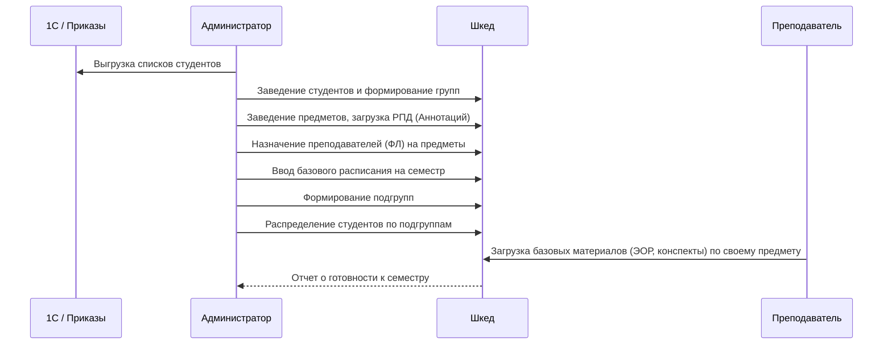
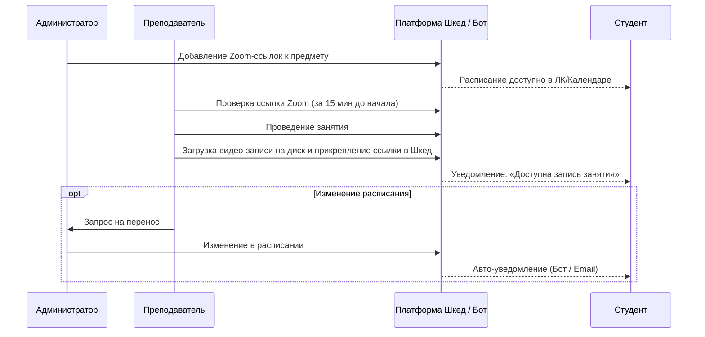
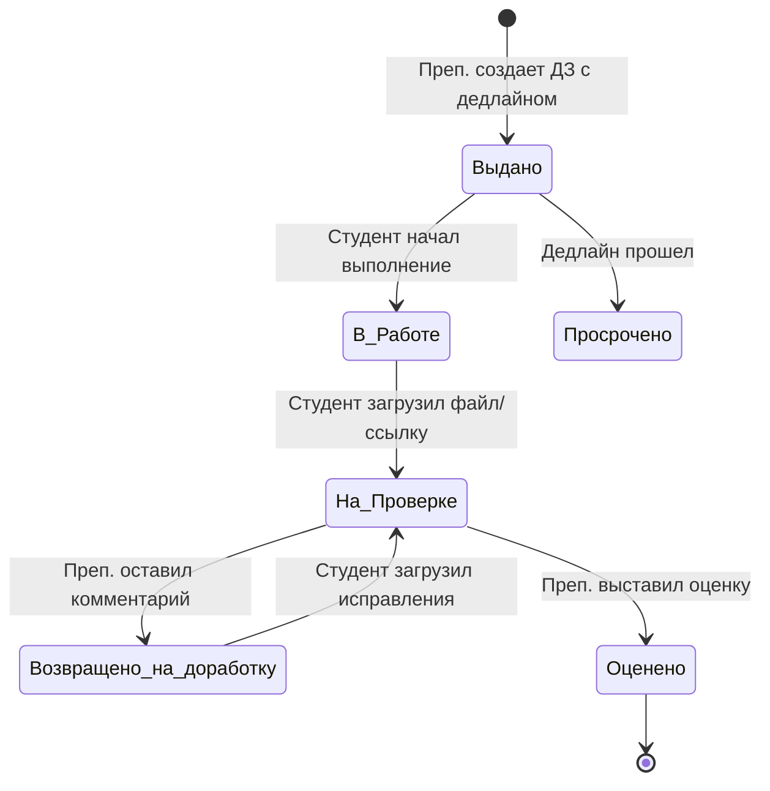
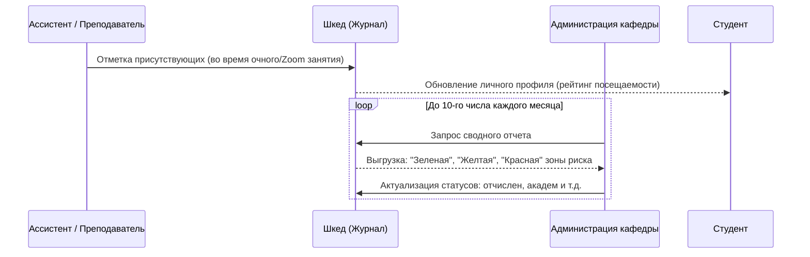
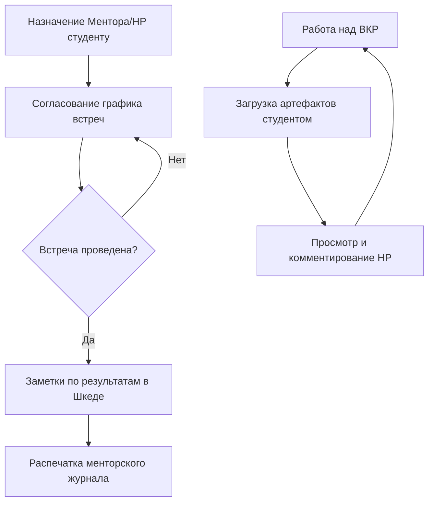

# 📋 Полный реестр бизнес-процессов платформы «Шкед» (To-Be)

На основе зафиксированных требований (KTP Variant 0) все потоки работ в системе можно разделить на 6 крупных макро-процессов. Платформа «Шкед» выступает единой точкой входа (Single Source of Truth) для каждого из них.

---

## 🏗 1. Подготовка к учебному периоду (Setup & Provisioning)
**Суть:** Формирование цифрового двойника учебного процесса до начала занятий.
**Ключевые роли:** Администратор (Учебный отдел).

---

## 📅 2. Управление расписанием и проведением занятий
**Суть:** Ежедневная рутина проведения занятий, обработка переносов и обеспечение доступа к онлайн-занятиям (Zoom).
**Ключевые роли:** Администратор, Преподаватель (Lector/Assistant), Студент.

---

## 📝 3. Жизненный цикл домашнего задания (Homework)
**Суть:** Полный цикл от выдачи задания до получения оценки студентом, включая коммуникацию и вопросы.
**Ключевые роли:** Преподаватель / Ассистент, Студент.

**Действия в рамках процесса:**
1. **Ассистент/Преподаватель:** Создает карточку ДЗ, описывает критерии, прикрепляет ссылки (ШСМ, Miro).
2. **Система:** Автоматически уведомляет студентов и напоминает за сутки до дедлайна.
3. **Студент:** Видит список дедлайнов в дашборде, загружает результат, задает вопросы через форум/чат предмета.
4. **Ассистент:** Проверяет, оставляет текстовый фидбек в системе, выставляет оценку.

---

## ✅ 4. Контроль посещаемости и мониторинг групп
**Суть:** Сбор данных о посещаемости занятий "в полях" и агрегация их на уровне учебного отдела для принятия решений.
**Ключевые роли:** Ассистент / Преподаватель, Администрация кафедры.

---

## 🎓 5. Аттестация (Зачеты и Экзамены)
**Суть:** Фиксация дедлайнов письменных работ и результатов сессии в едином месте для прозрачности.
**Ключевые роли:** Администратор, Преподаватель / Ассистент, Студент, Методист кафедры.

1. **Планирование:** Администратор заводит события «Зачет/Экзамен» в расписание сессии.
2. **Оповещение:** Студенты получают уведомления через Telegram-бота о датах.
3. **Проведение:** Преподаватель принимает экзамен/зачет.
4. **Фиксация результатов:** Преподаватель/Ассистент вносит оценки напрямую в систему.
5. **Документооборот:** Выгрузка из системы заполненной электронной ведомости для передачи методисту кафедры и/или загрузки в систему 1С университета.

---

## 🤝 6. Менторство, ВКР и Социальная поддержка
**Суть:** Управление индивидуальными треками студентов, дипломными работами и психологическим климатом.
**Ключевые роли:** Ментор / Научный руководитель (НР), Студент, Куратор.

**Дополнительные функции коммуникации:**
- **Форумы предметов:** Организованное обсуждение материалов с модерацией (Студенты + Преподаватели).
- **Информирование:** Массовые рассылки от Учебного отдела о внеучебных мероприятиях через Telegram.
- **Жалобы и предложения:** Форма обратной связи от студентов непосредственно в учебный офис для оперативного реагирования.
