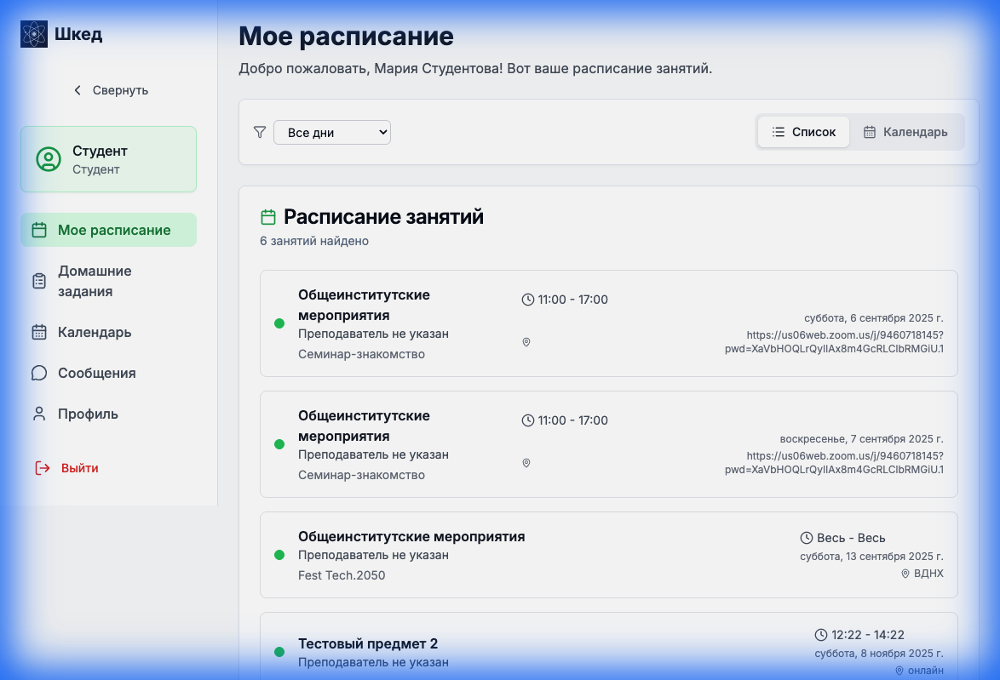
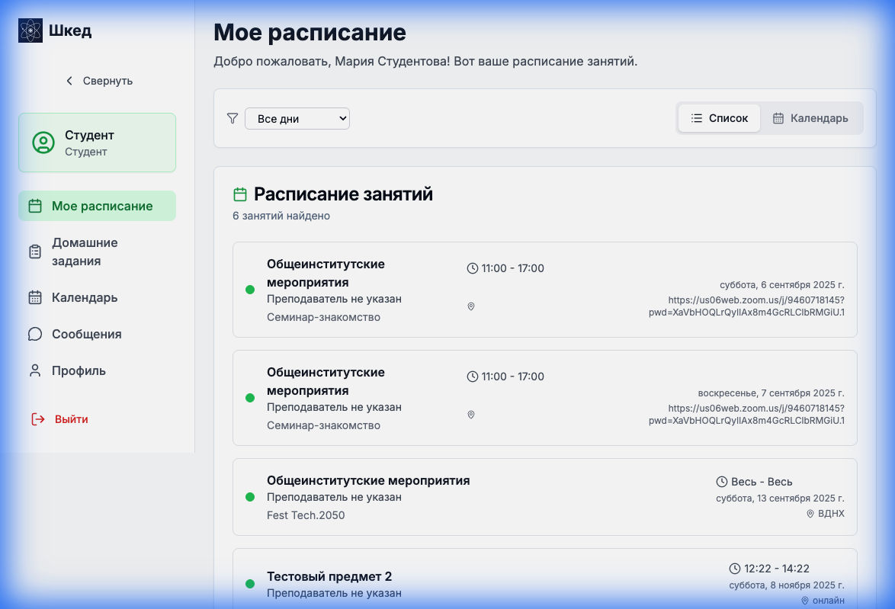
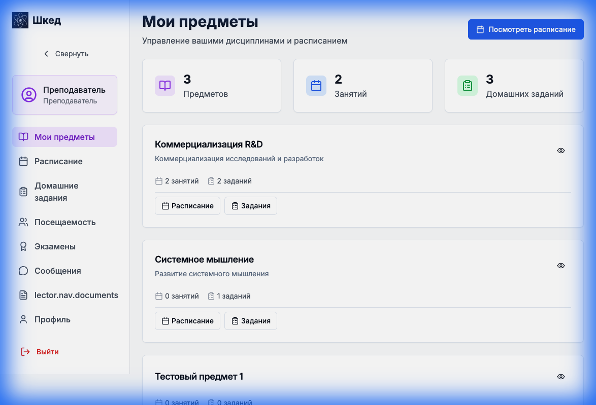
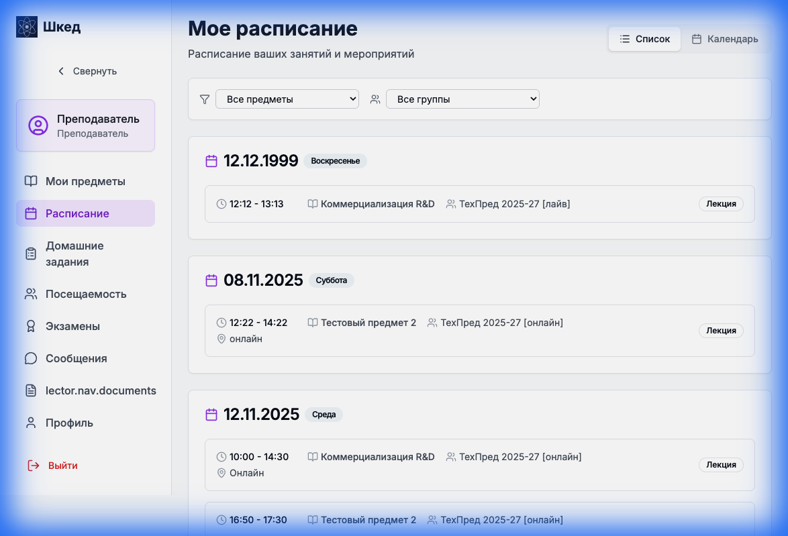
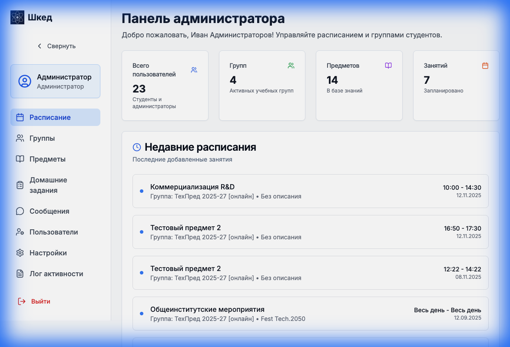
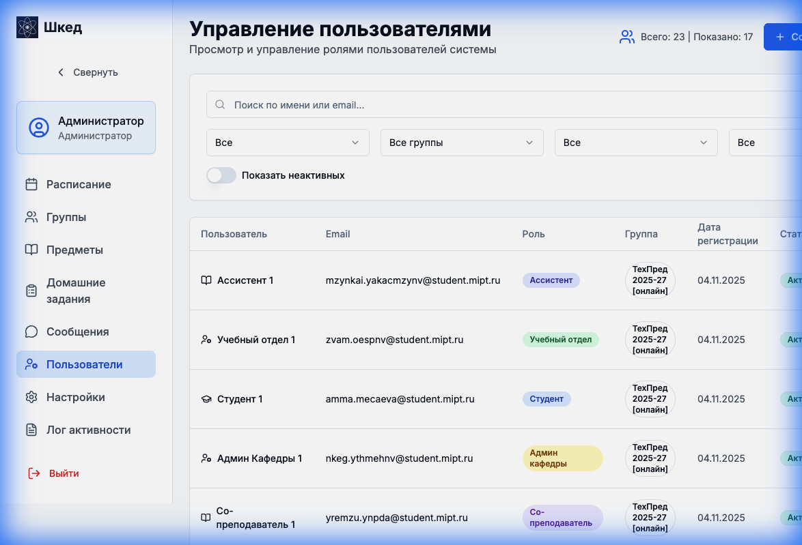

# Руководство пользователя платформы Шкед

В данном руководстве представлены пошаговые инструкции для основных сценариев использования платформы **Шкед** для Студентов, Преподавателей и Администраторов.

## Оглавление
1.  [Начало работы](#начало-работы)
2.  [Руководство для Студента](#руководство-для-студента)
3.  [Руководство для Преподавателя](#руководство-для-преподавателя)
4.  [Руководство для Администратора](#руководство-для-администратора)
5.  [Руководство для Ментора](#руководство-для-ментора)
6.  [Руководство для Руководства кафедры](#руководство-для-руководства-кафедры)

---

## Начало работы

### Доступ к платформе
**URL:** [https://shked.innovators.moscow](https://shked.innovators.moscow)

Главная страница содержит обзор ключевых возможностей системы: управление расписанием, отслеживание домашних заданий и учет посещаемости.

### Вход в систему
Нажмите кнопку **"Войти"** в правом верхнем углу экрана. Вы будете перенаправлены на страницу входа.

**Примечание:** Для ознакомления с системой на странице входа доступен список демо-аккаунтов для различных ролей (Администратор, Студент, Преподаватель и др.).

---

## Руководство для Студента

**Цель:** Просмотр личного расписания и предстоящих занятий.

### 1. Авторизация
Используйте учетные данные студента (например, `student@demo.com` / `student123`).

### 2. Обзор Личного кабинета
После входа вы попадете в **Личный кабинет студента**. Боковое меню обеспечивает быстрый доступ к разделам:
*   **Мое расписание**
*   **Домашние задания**
*   **Календарь**
*   **Сообщения**

### 3. Просмотр Расписания
В этом разделе отображаются ближайшие занятия. Вы можете видеть название предмета, время, формат (Семинар/Лекция) и место проведения (или ссылку на Zoom).

---

## Руководство для Преподавателя

**Цель:** Управление предметами и просмотр расписания преподавания.

### 1. Авторизация
Используйте учетные данные преподавателя (например, `lector@demo.com` / `lector123`).

### 2. Обзор Личного кабинета
**Кабинет преподавателя** открывается на вкладке **"Мои предметы"**. Здесь отображается список курсов, которые вы читаете, количество групп и статус домашних заданий.

### 3. Управление Расписанием
Нажмите на **"Расписание"** в боковом меню, чтобы увидеть свой календарь преподавания. Этот вид помогает планировать лекции и семинары.

---

## Руководство для Администратора

**Цель:** Управление пользователями и настройки системы.

### 1. Авторизация
Используйте учетные данные администратора (например, `admin@shked.com` / `admin123`).

### 2. Обзор Панели Администратора
**Панель администратора** предоставляет доступ к метрикам и управлению системой. Меню включает управление Группами, Предметами, и детальный **Лог активности**.

### 3. Управление Пользователями
Перейдите в раздел **"Пользователи"** для управления аккаунтами. Вы можете просматривать список всех зарегистрированных пользователей, фильтровать их по ролям (Студент, Преподаватель и т.д.) и проверять их статус.

---

## Руководство для Ментора

**Цель:** Взаимодействие со студентами по ВКР, согласование встреч и проверка артефактов.

### 1. Авторизация
Используйте учетные данные ментора (например, `mentor@demo.com` / `mentor123`).

### 2. График встреч
В личном кабинете доступен календарь встреч со студентами. Вы можете согласовывать предложенное время или назначать новые слоты для консультаций по ВКР.

### 3. Работа с ВКР
Перейдите в профиль студента для просмотра загруженных артефактов ВКР. Вы можете оставлять комментарии к документам и отслеживать прогресс выполнения этапов работы.

---

## Руководство для Руководства кафедры

**Цель:** Мониторинг успеваемости и посещаемости, формирование отчетности.

### 1. Авторизация
Используйте учетные данные заведующего кафедрой (например, `head@demo.com` / `head123`).

### 2. Отчеты и статистика
Вам доступны сводные отчеты по кафедре:
*   **Отчет о посещаемости:** Просмотр статистики посещений по группам и предметам.
*   **Отчет об успеваемости:** Рейтинги студентов и результаты сессий.

### 3. Списки студентов
Вы можете просматривать актуальные списки студентов, их статусы (активен/академ/отчислен) и детальные профили, включая активность на форумах.
