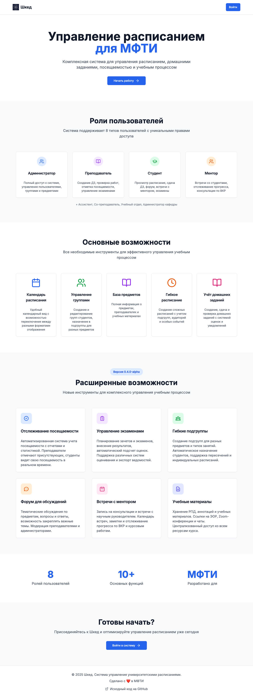
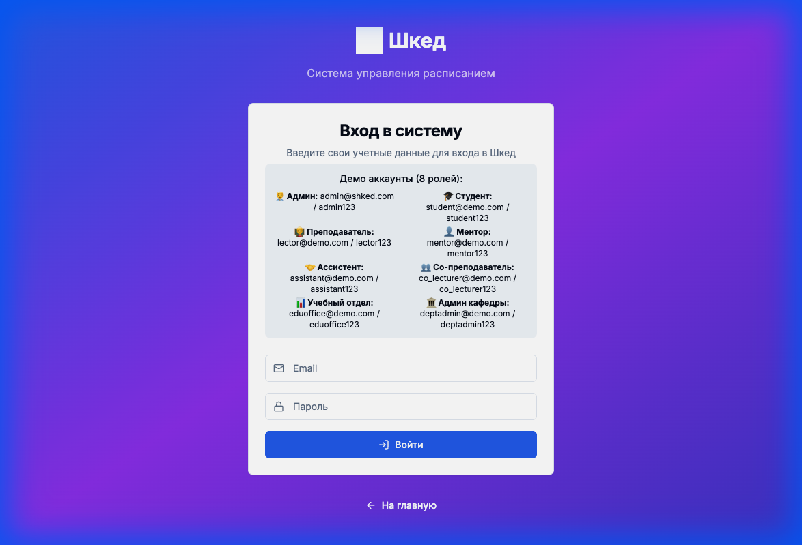

# Руководство пользователя платформы Шкед

В данном руководстве представлены пошаговые инструкции для основных сценариев использования (CJM) платформы **Шкед** для всех поддерживаемых ролей.

## Оглавление
1.  [Начало работы](#начало-работы)
2.  [Руководство для Студента](./student.md)
3.  [Руководство для Преподавателя](./teacher.md)
4.  [Руководство для Администратора](./admin.md)
5.  [Руководство для Ментора](./mentor.md)
6.  [Руководство для Руководства кафедры](./department-head.md)

---

## Начало работы

### Доступ к платформе
**URL:** [https://shked.innovators.moscow](https://shked.innovators.moscow)

Главная страница содержит обзор ключевых возможностей системы: управление расписанием, отслеживание домашних заданий и учет посещаемости.

### Вход в систему
Нажмите кнопку **"Войти"** в правом верхнем углу экрана. Вы будете перенаправлены на страницу входа.

**Примечание:** Для ознакомления с системой на странице входа доступен список демо-аккаунтов для различных ролей (Администратор, Студент, Преподаватель и др.).

---

Вышеперечисленные руководства по ролям предоставляют детальную информацию о том, как использовать систему Шкед в зависимости от вашей зоны ответственности. Выберите соответствующий раздел в Оглавлении для перехода к пошаговым инструкциям.
