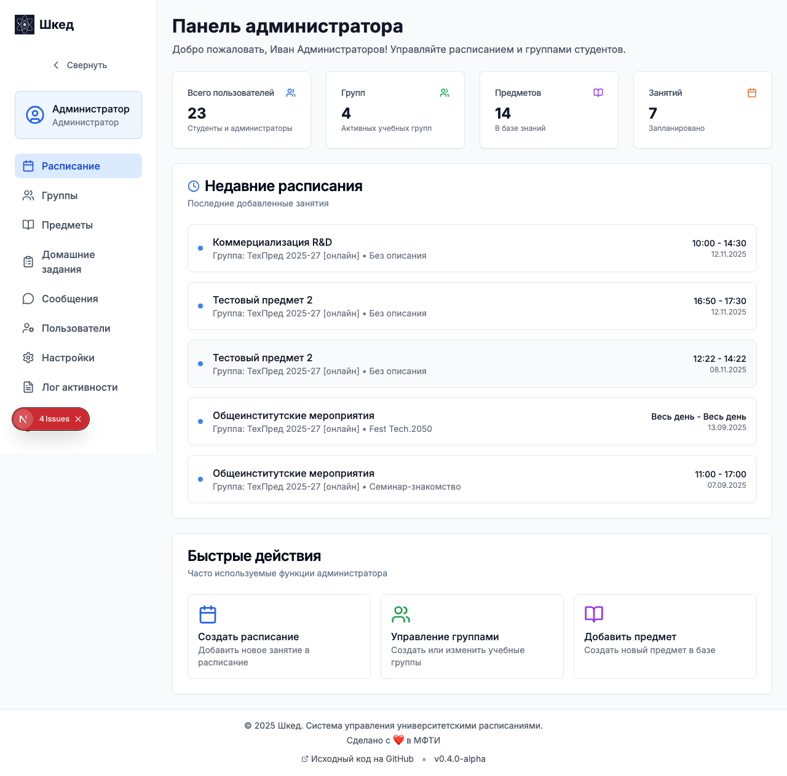
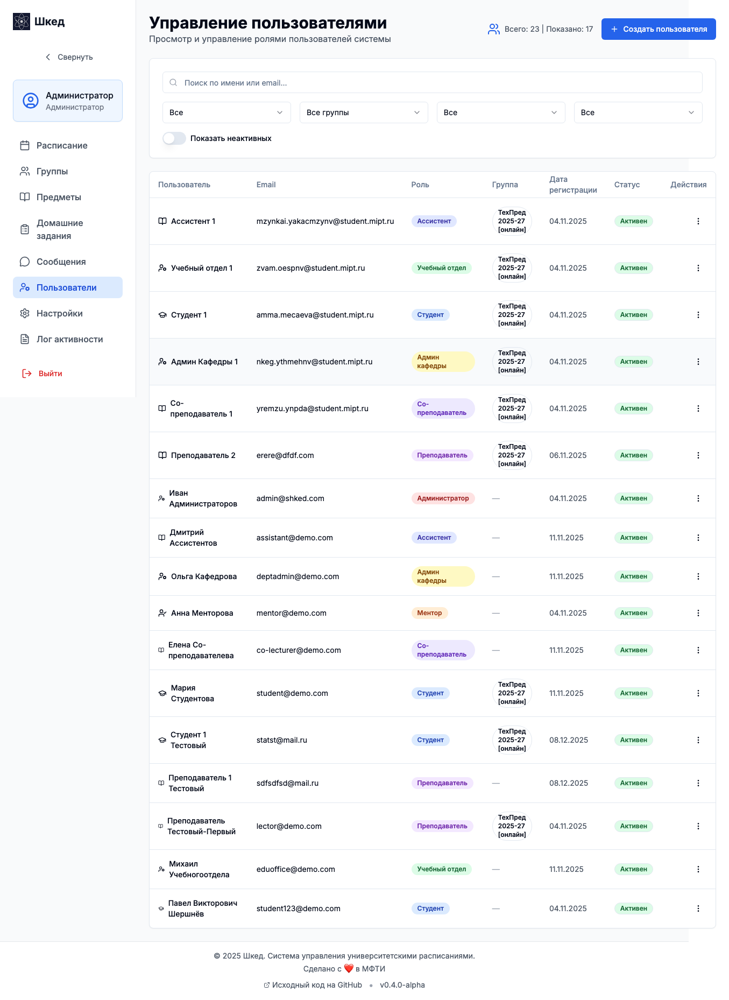
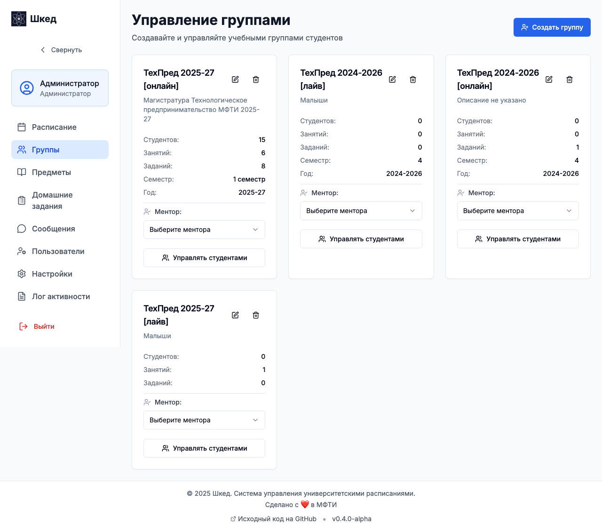
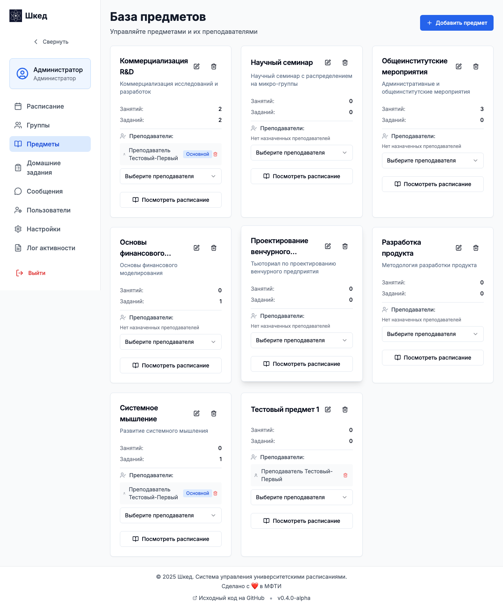
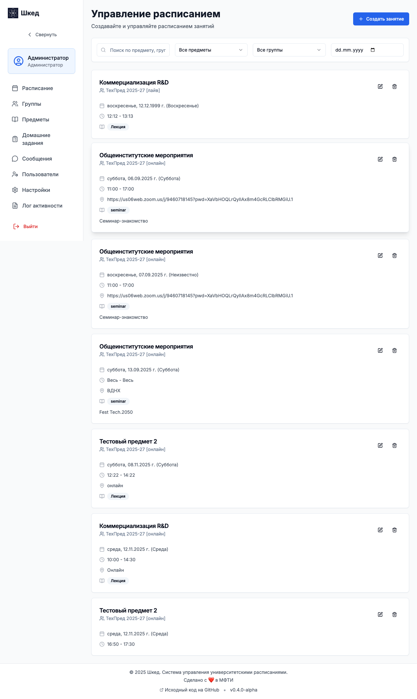
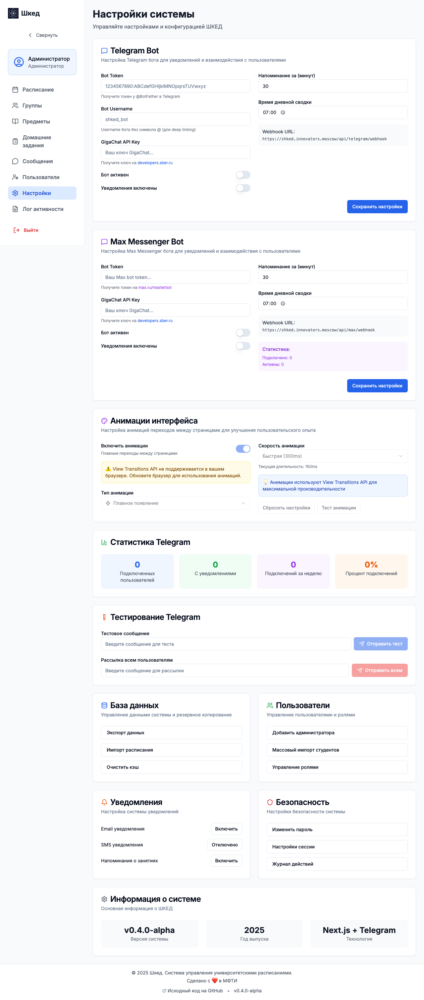

# Руководство администратора (Сценарии использования)

В данном руководстве описаны основные сценарии работы администратора платформы Шкед. Роль администратора предоставляет полный доступ к управлению системой, пользователями и учебным процессом.

## Сценарий 1: Мониторинг активности системы

**Цель:** Оценить общее состояние системы, количество активных пользователей и групп.

1. Авторизуйтесь в системе с правами **Администратора**.
2. По умолчанию вы попадете на **Главную страницу** платформы.
3. Ознакомьтесь со сводными метриками в верхней части экрана (количество пользователей по ролям, количество учебных групп, предметов и активных заданий).
4. Просмотрите ленту последних событий/расписание на неделю, чтобы убедиться в штатной работе системы.

## Сценарий 2: Управление пользователями (создание и изменение роли)

**Цель:** Добавить в систему нового преподавателя/студента или изменить роль уже существующему.

1. Перейдите в раздел **Пользователи** в меню администратора.
2. Для **создания нового пользователя**:
   - Нажмите кнопку **Создать пользователя**.
   - Введите его Email и укажите нужную роль (например: *student*, *lector*, *mentor*, *admin*).
   - Если это студент, обязательно выберите учебную группу.
   - Сохраните — система сгенерирует временный пароль для первого входа пользователя.
3. Для **изменения роли** существующему пользователю:
   - Найдите его в списке или воспользуйтесь поиском.
   - Откройте карточку пользователя или нажмите иконку редактирования.
   - Измените роль в выпадающем списке и сохраните (изменения применяются мгновенно, но сработают при следующем входе пользователя).

## Сценарий 3: Создание учебной группы

**Цель:** Сформировать новую группу студентов на семестр и назначить им ментора.

1. Откройте раздел **Группы**.
2. Нажмите **Создать группу**.
3. Укажите уникальное название группы (например, Б05-321).
4. В поле "Ментор" выберите куратора для этой группы (необязательно, но рекомендуется).
5. Сохраните группу. В дальнейшем вы сможете добавлять в неё студентов как через меню группы, так и при создании учетных записей.

## Сценарий 4: Назначение преподавателя к предмету

**Цель:** Дать лектору права на создание ДЗ и управление предметом.

1. Перейдите в раздел **Предметы**.
2. В списке найдите нужный предмет и откройте его параметры для редактирования.
3. В специальном блоке "Преподаватели" выберите пользователя с ролью `lector` (лектор, ассистент или со-преподаватель).
4. Нажмите сохранить. Теперь выбранный преподаватель увидит этот предмет в своем профиле и сможет публиковать по нему домашние задания.

## Сценарий 5: Составление расписания занятий

**Цель:** Заполнить сетку расписания лекциями и семинарами.

1. Откройте раздел **Расписание**.
2. Нажмите **Добавить занятие**.
3. Заполните форму:
   - **Предмет и Группа** для которых проводится занятие.
   - Опционально: выберите **подгруппу**, если поток разделен пополам.
   - **Тип:** Лекция, Семинар или Лабораторная.
   - **Дата, время и аудитория**.
4. Сохраните. Изменения тут же станут доступны в календарях студентов и преподавателей.

## Сценарий 6: Настройка Telegram-бота

**Цель:** Включить и настроить систему автоматических уведомлений.

1. Откройте раздел **Настройки бота** (или вкладку интеграций в общих системных настройках).
2. Чтобы активировать бота, убедитесь, что в поле `Токен` введен корректный ключ вашего Telegram-бота.
3. Вы можете включить или отключить глобальную рассылку.
4. Настройте типы уведомлений: за сколько минут отправлять напоминания о занятиях, когда формировать дневную сводку, предупреждения о дедлайнах ДЗ.
5. Примените настройки — система обновит конфигурацию уведомлений без перезапуска приложения.

