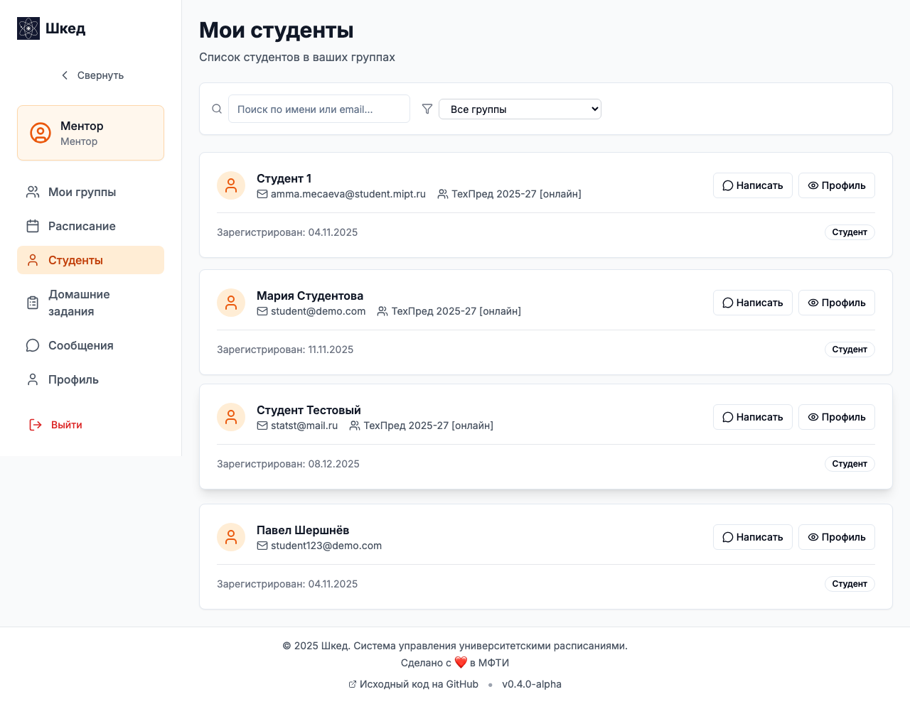
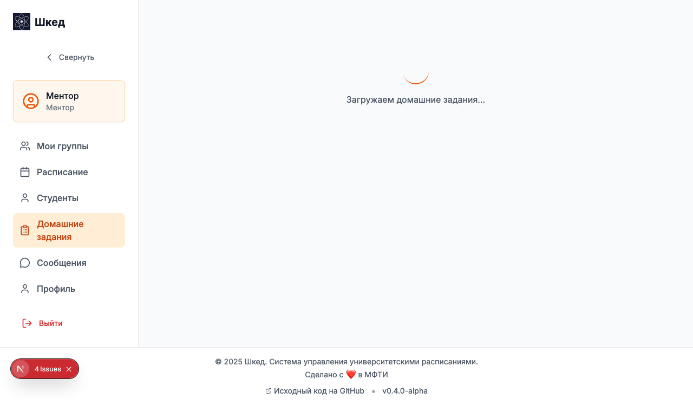
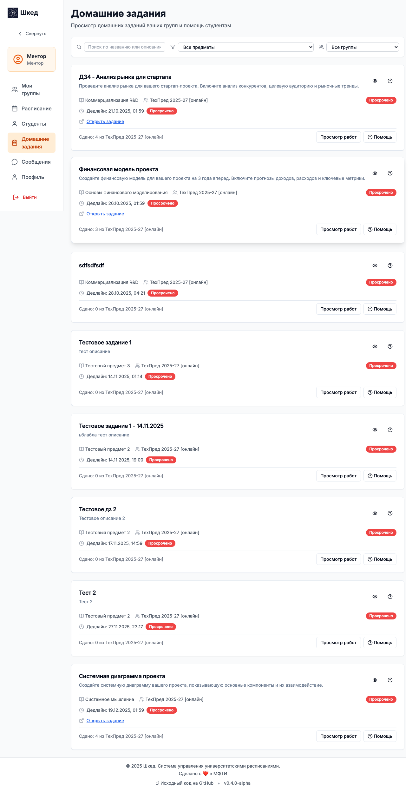
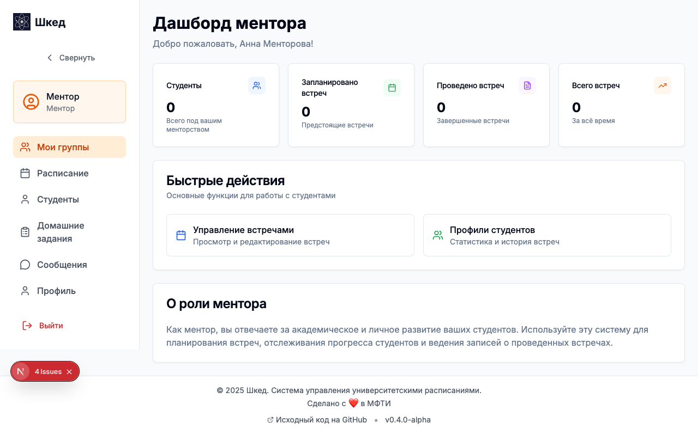
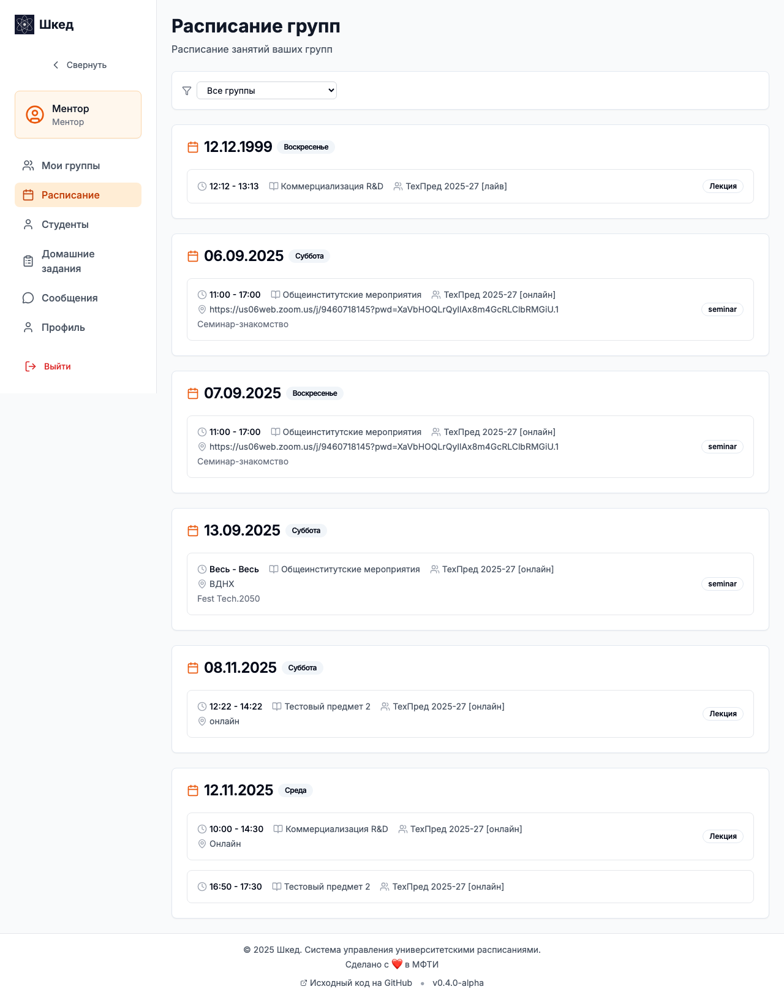
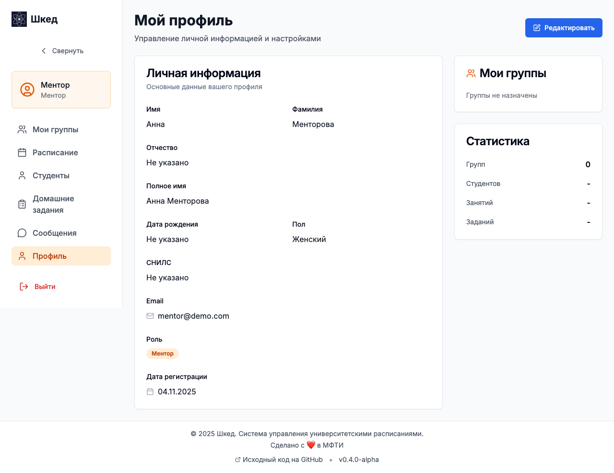

# Руководство ментора (Сценарии использования)

В данном руководстве описаны основные сценарии работы ментора (куратора) групп в системе Шкед. Ваша главная задача — помогать студентам, следить за их успеваемостью и вовремя выявлять проблемы. *Обратите внимание: ментор не может создавать и проверять домашние задания.*

## Сценарий 1: Просмотр списка своих студентов

**Цель:** Узнать, какие студенты закреплены за вами, и найти их контактные данные.

1. Войдите в систему под учетной записью **Ментора**.
2. В боковом меню выберите раздел **Студенты**.
3. Вы увидите список всех групп, для которых вы назначены ментором.
4. Выберите нужную группу, чтобы раскрыть полный список студентов.
5. В карточке каждого студента доступны его контактные данные (Email, Telegram) и информация о подгруппах.

## Сценарий 2: Мониторинг выполнения домашних заданий

**Цель:** Оценить, как группа справляется с текущими заданиями, и кому требуется помощь.

1. Откройте раздел **Домашние задания** в боковом меню.
2. В открывшемся списке отображаются все активные задания для ваших групп.
3. По каждому заданию выведена сводная статистика (например: *«Сдано 15 из 20»*).
4. Кликните на задание, чтобы увидеть детальный список студентов. Вы сможете увидеть, кто уже сдал, чья работа проверена, а у кого приближается дедлайн или уже просрочен.

## Сценарий 3: Просмотр работы студента (Read-only)

**Цель:** Ознакомиться с решением студента и комментариями преподавателя для оказания помощи.

1. Находясь в списке домашних заданий (или через профиль конкретного студента), выберите сданную работу.
2. Откроется страница с полным (MDX) описанием задания и отправленным решением студента.
3. Если работа уже проверена преподавателем, вы увидите итоговую оценку, общий отзыв и inline-комментарии к конкретным фрагментам текста/кода.
4. *Примечание: вы можете только просматривать эти данные для последующего обсуждения со студентом, опций редактирования и оценки у ментора нет.*

## Сценарий 4: Работа со списком «Требуют внимания»

**Цель:** Вовремя выявить студентов с проблемами (низкая успеваемость, пропуски дедлайнов).

1. Перейдите на **Главную страницу**.
2. Обратите внимание на виджет **Требуют внимания**. Система автоматически анализирует данные и выводит сюда проблемных студентов.
3. В списке указана причина попадания в виджет: много просроченных заданий, низкая средняя оценка или долгое отсутствие в системе.
4. Нажмите на карточку студента, чтобы быстро написать ему в Telegram или на Email.

## Сценарий 5: Просмотр расписания подопечных групп

**Цель:** Узнать, когда у студентов пары, чтобы не отвлекать их или запланировать консультацию.

1. Перейдите в раздел **Расписание**.
2. Выберите одну из своих групп.
3. На экране отобразится календарный вид расписания со всеми лекциями, семинарами и указанием подгрупп.
4. Используйте эту информацию для планирования общих встреч с группой.

## Сценарий 6: Telegram-уведомления для ментора

**Цель:** Подключить бота, чтобы оперативно узнавать о проблемах в группе.

1. Зайдите в свой **Профиль**.
2. Скопируйте **токен привязки**.
3. Отправьте боту Шкед команду `/link ВАШ_ТОКЕН`.
4. Бот начнет присылать вам важные оповещения:
   - Если студент из вашей группы пропустил дедлайн.
   - Еженедельные сводки по успеваемости группы.
   - Оповещения о длительном отсутствии студента в системе.

