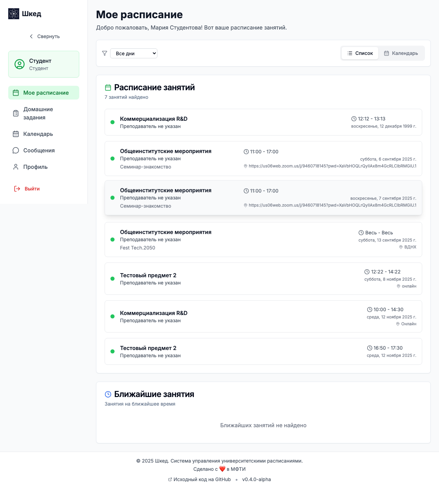
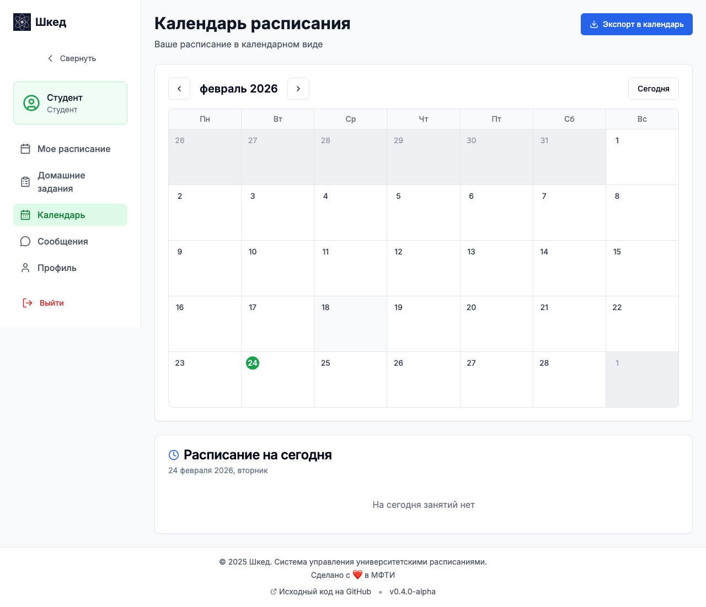
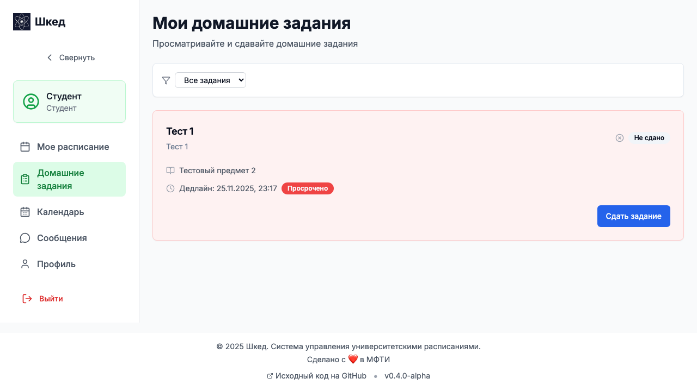
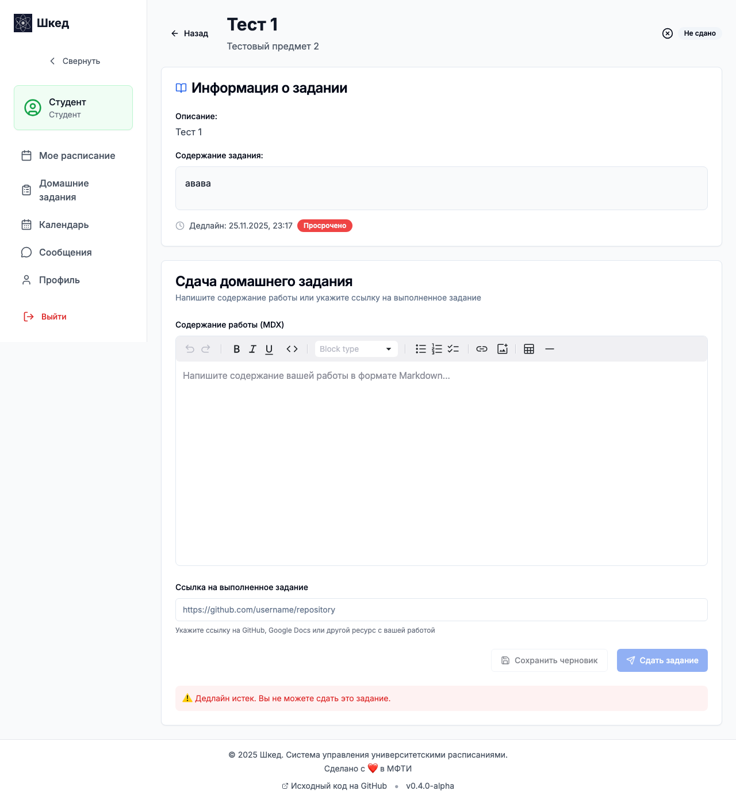
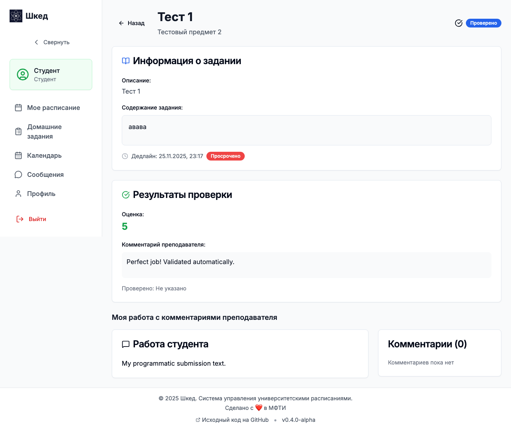
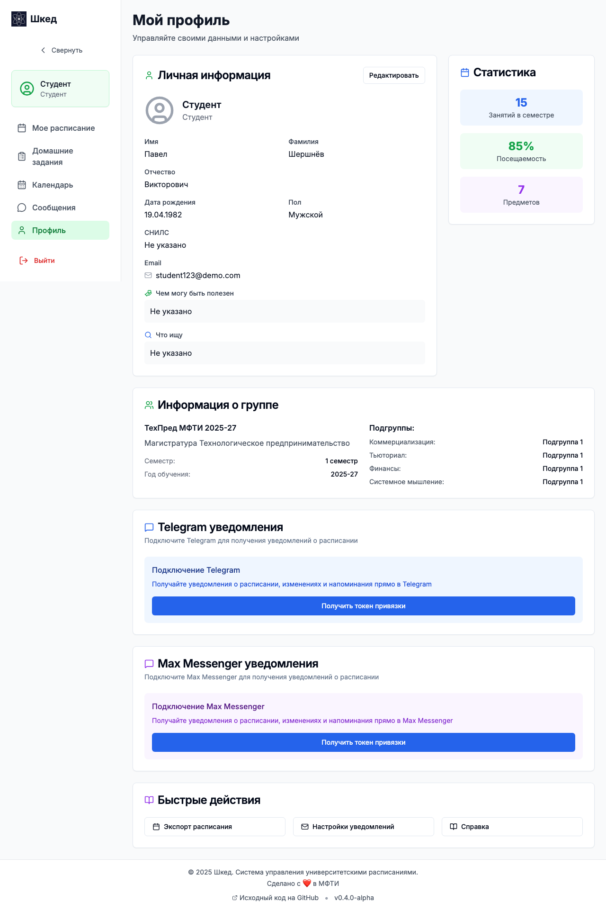
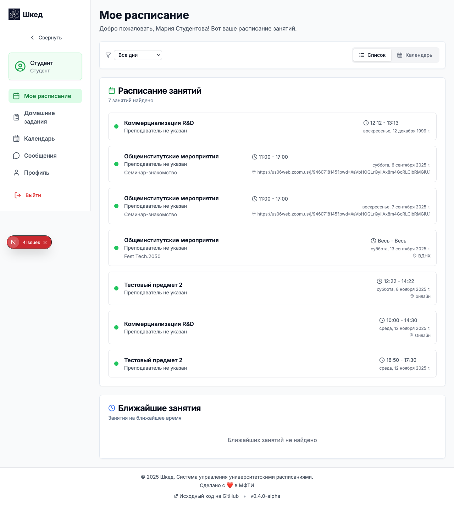

# Руководство студента (Сценарии использования)

В данном руководстве описаны основные сценарии работы студента с платформой Шкед.

## Сценарий 1: Просмотр расписания на неделю

**Цель:** Спланировать свою неделю, узнать время, место и формат занятий с учетом ваших подгрупп.

1. Войдите в систему под учетной записью **Студента**.
2. В боковом меню выберите пункт **Расписание** (это также главная страница вашего профиля).
3. Платформа автоматически отфильтрует занятия с учетом ваших подгрупп (например, если вы в первой подгруппе по английскому языку, вы увидите только расписание для этой подгруппы).
4. Ознакомьтесь с деталями занятия на карточке: время начала и конца, название предмета, тип занятия (Лекция/Семинар), преподаватель и аудитория (или ссылка на онлайн-встречу).
5. Чтобы переключиться на другую неделю, используйте навигацию дат в верхней части экрана.
6. Для более наглядного отображения перейдите в раздел **Календарь** в боковом меню, где расписание представлено в виде сетки на месяц или неделю.

## Сценарий 2: Просмотр списка домашних заданий

**Цель:** Узнать список заданий, дедлайны и свой прогресс.

1. В боковом меню выберите пункт **Домашние задания**.
2. На открывшейся странице задания разделены на три вкладки:
   - **Активные:** Задания, которые вам нужно выполнить (еще не сданы). Внимание: срочные дедлайны будут визуально выделены!
   - **Сданные:** Вы отправили решение, оно ожидает проверки преподавателем.
   - **Проверенные:** Задания проверены, выставлена оценка и, возможно, есть комментарии к решению.
3. При необходимости используйте фильтр по предметам в верхней части экрана для быстрого поиска задания.

## Сценарий 3: Сдача домашнего задания

**Цель:** Написать и отправить решение преподавателю.

1. В списке домашних заданий (вкладка **Активные**) выберите нужную работу и кликните по ней.
2. Изучите полное описание задания и прикрепленные материалы, обратите внимание на дедлайн.
3. В нижней части страницы находится MDX-редактор для ввода вашего решения.
4. Оформите ваше решение: вы можете использовать заголовки, списки, добавлять фрагменты кода, таблицы и математические формулы. При необходимости добавьте ссылку на внешние материалы (например, на Google Drive или репозиторий GitHub).
5. Убедитесь, что всё введено корректно, и нажмите кнопку отправки (Сдать работу). Вы получите уведомление об успешной отправке.

## Сценарий 4: Просмотр обратной связи по проверенной работе

**Цель:** Узнать свою оценку и прочитать комментарии преподавателя по сданной работе.

1. В разделе **Домашние задания** перейдите на вкладку **Проверенные**.
2. Откройте нужную работу кликом.
3. На странице вы увидите выставленную преподавателем оценку.
4. Ниже отображается подробный отзыв (feedback) от преподавателя.
5. Прокрутите страницу до вашего исходного решения — преподаватель мог оставить *inline-комментарии* к конкретным абзацам или строкам кода, чтобы указать на точные ошибки или удачные решения.

## Сценарий 5: Привязка Telegram-аккаунта и уведомления

**Цель:** Включить получение напоминаний о парах и дедлайнах прямо в Telegram-бот.

1. Перейдите в раздел **Профиль** (через боковое меню или кликнув по своему имени в углу экрана).
2. На странице профиля найдите блок интеграции с Telegram и нажмите кнопку **Получить токен привязки**.
3. Скопируйте сгенерированный токен для бота.
4. Откройте Telegram-бот Шкед (ссылка указана в интерфейсе системы).
5. Отправьте боту команду `/link ВАШ_ТОКЕН` (замените ВАШ_ТОКЕН на скопированный из системы код).
6. Вы получите подтверждение в Telegram, что аккаунт успешно привязан.
7. Теперь бот будет присылать вам напоминания:
   - За 30 минут до начала занятия.
   - В 7:00 утра — сводку расписания на день.
   - За 24 часа и за 2 часа до дедлайна по домашнему заданию.
8. Вы можете запросить информацию у бота прямо в чате на естественном языке, например: «Какие домашки у меня есть?» или «Когда моя следующая пара?».

## Сценарий 6: Отслеживание своего прогресса

**Цель:** Оценить свою общую успеваемость и сданные ДЗ.

1. Перейдите на **Главную страницу** (`/student`).
2. В виджетах статистики отображается общая картина: сколько заданий сдано из общего числа, количество заданий на проверке и предстоящие дедлайны.
3. (При наличии) Изучите статистику и среднюю оценку по всем вашим предметам для оценки текущего академического прогресса.

