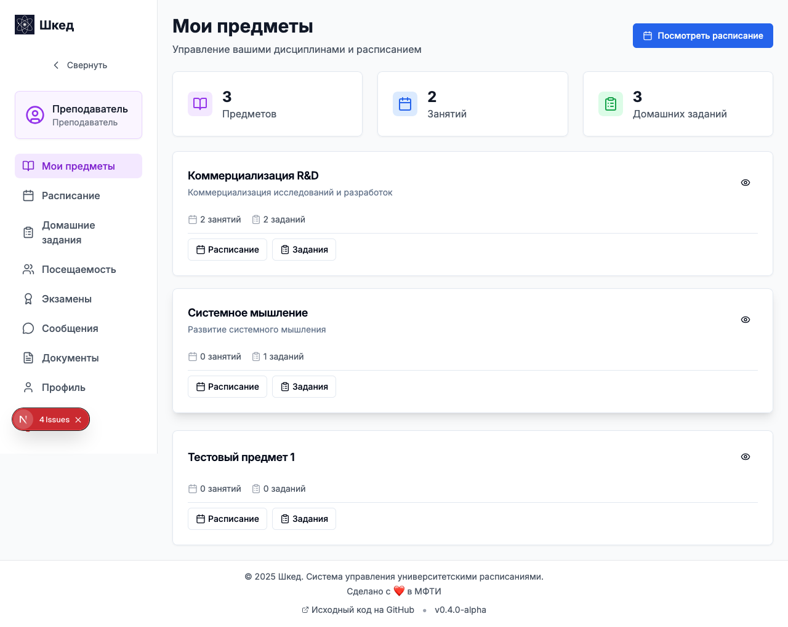
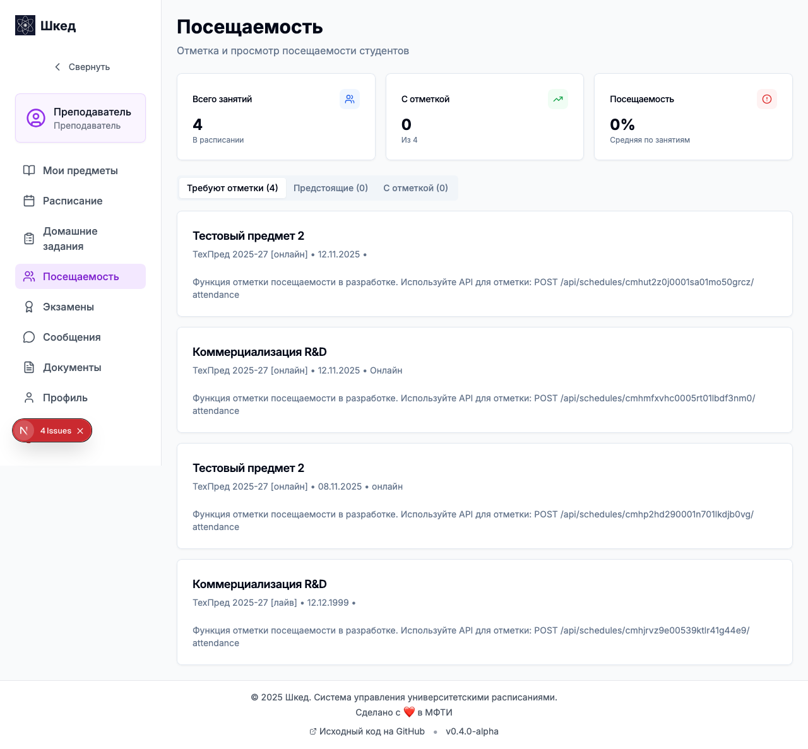
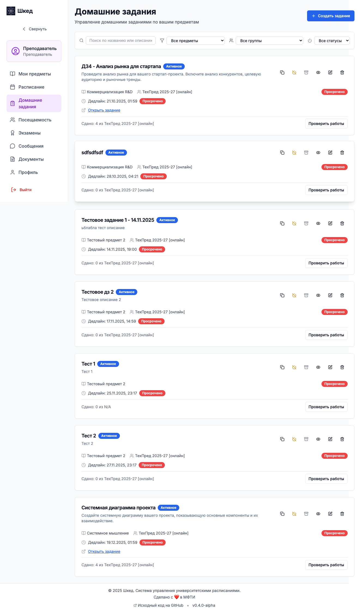
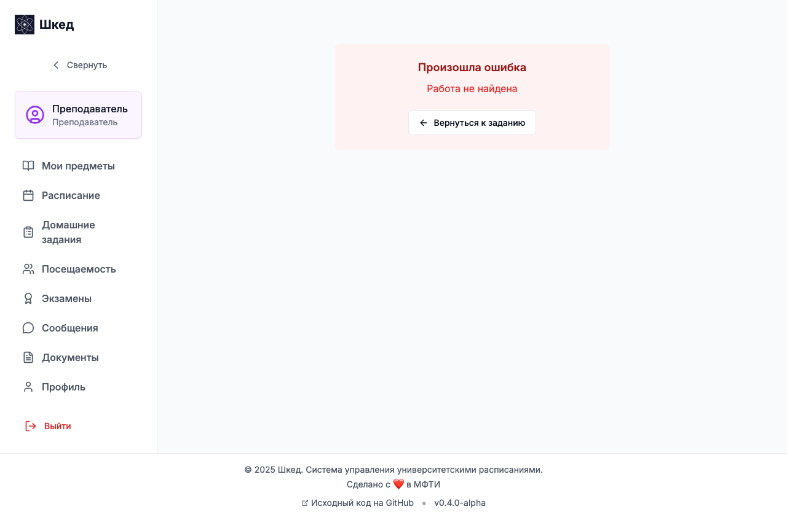
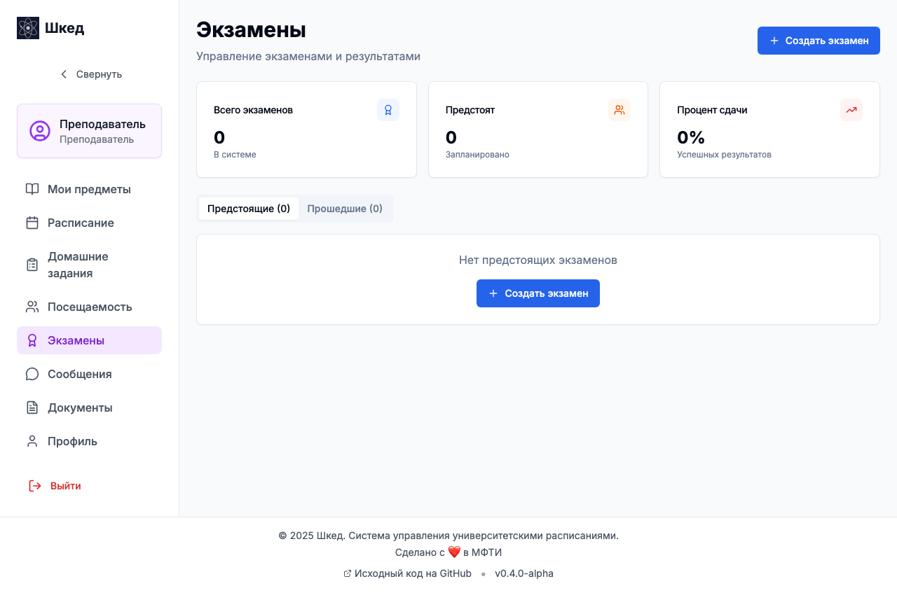
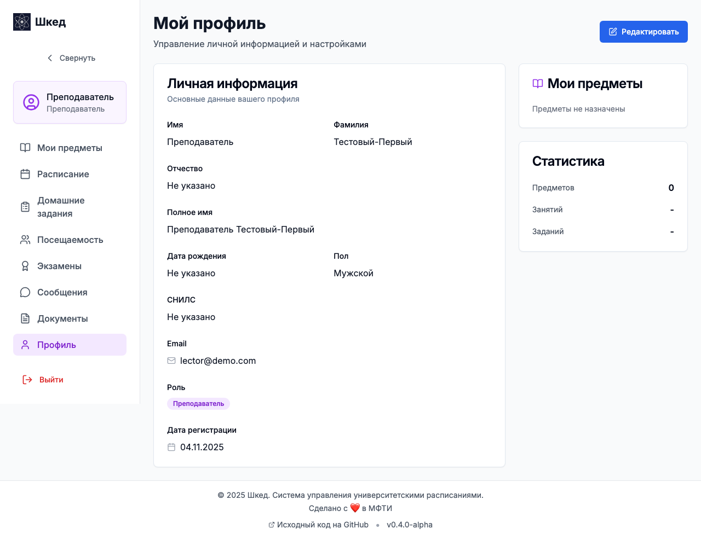

# Руководство преподавателя (Сценарии использования)

В данном руководстве описаны основные сценарии работы преподавателя (лектора) в системе Шкед.

## Сценарий 1: Просмотр своих предметов и расписания

**Цель:** Оценить загрузку, узнать список своих курсов и предстоящих занятий.

1. Войдите в систему под учетной записью **Преподавателя**.
2. В боковом меню выберите **Главная**, чтобы увидеть список назначенных вам предметов, статистику по домашним заданиям и ближайшие пары.
3. Для более детального планирования перейдите в раздел **Расписание**.
4. В расписании вы найдете календарный вид занятий по вашим предметам, включая информацию о группах, подгруппах и ссылки на внешние ресурсы (например, Zoom).

## Сценарий 2: Отметка посещаемости на занятии

**Цель:** Быстро отметить присутствующих и отсутствующих студентов на семинаре или лекции.

1. Перейдите в раздел **Посещаемость** в боковом меню.
2. Выберите из списка занятий то, которое сейчас идет (или недавно завершилось).
3. На странице занятия отобразится список студентов выбранной группы или подгруппы.
4. Вы можете использовать функции быстрой отметки всех студентов или пройтись по списку, выставляя статусы: *Присутствует, Отсутствует, Опоздал, Уважительная причина*.
5. (Опционально) Оставьте текстовую заметку к конкретной отметке студента.
6. Данные о посещаемости сохраняются автоматически. 

## Сценарий 3: Создание домашнего задания

**Цель:** Выдать задание группе студентов по своему предмету.

1. Откройте раздел **Домашние задания** и перейдите на вкладку **Мои задания**.
2. Нажмите кнопку создания нового задания.
3. Выберите предмет и группу, для которой предназначается работа.
4. Введите название и укажите дедлайн.
5. Заполните описание задания, используя встроенный MDX-редактор: вы можете использовать форматирование, вставлять таблицы, формулы и прикреплять ссылки на материалы.
6. После проверки всех данных нажмите кнопку **Создать**. Студенты выбранной группы сразу увидят это задание в своих личных кабинетах.

## Сценарий 4: Проверка сданных работ и обратная связь

**Цель:** Проверить решения студентов, выставить оценки и указать на ошибки.

1. Перейдите в раздел **Домашние задания** и откройте вкладку **На проверке**.
2. Выберите работу студента из списка ожидания.
3. Ознакомьтесь с присланным решением (оно также оформлено в MDX).
4. **Оценка и развернутый отзыв:** В специальном блоке выставьте итоговую оценку (grade) и напишите общий текстовый комментарий по качеству выполнения работы.
5. **Inline-комментарии:** Если вы хотите указать на конкретную ошибку в тексте решения, выделите сомнительный фрагмент или кликните возле нужной строки кода/текста и оставьте точечный комментарий. Это поможет студенту быстрее понять, где именно была допущена ошибка.
6. Сохраните проверку (статус работы изменится на `REVIEWED`). Студент получит уведомление о том, что работа проверена.

## Сценарий 5: Создание и управление экзаменами

**Цель:** Назначить дату экзамена или зачета и внести результаты (ведомость).

1. Перейдите в раздел **Экзамены**.
2. Чтобы запланировать аттестацию, нажмите кнопку создания экзамена. Заполните форму: выберите свой предмет, группу, тип аттестации (Экзамен/Зачет/Дифф. зачет), формат проведения (Устный/Письменный) и дату/аудиторию.
3. Когда экзамен будет проведен, выберите его в списке и откройте форму внесения результатов.
4. Заполните электронную ведомость оценками для каждого студента.
5. Сохраните ведомость. Данные отразятся в статистике успеваемости.

## Сценарий 6: Telegram-уведомления

**Цель:** Подключить бота для получения сводок и напоминаний в Telegram.

1. Перейдите в свой **Профиль**.
2. Нажмите **Получить токен привязки** и скопируйте его.
3. В Telegram найдите бота Шкед и отправьте ему `/link ВАШ_ТОКЕН`.
4. После успешной привязки вы начнете автоматически получать важные системные уведомления, в том числе:
   - Напоминания о новых сданных на проверку работах студентов.
   - Еженедельную сводку по непроверенным заданиям.
   - Напоминания о предстоящих занятиях и необходимости отметить посещаемость.
5. Бот понимает специальные команды, такие как `/pending` (список работ на проверке) или `/attendance` (список занятий без отмеченной посещаемости).

