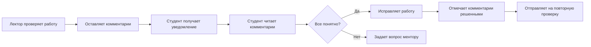

# HomeworkComment (Модель данных)

> Инлайн-комментарии к домашнему заданию

## Описание

Модель `HomeworkComment` представляет комментарии, оставленные преподавателями или менторами к конкретным частям работы студента. Это инлайн-комментарии, привязанные к определенным строкам в тексте работы.

**Функция**: [[Система домашних заданий]]  
**Компонент**: [[inline-comment-viewer.tsx]]

## Prisma Schema

```prisma
model HomeworkComment {
  id           String              @id @default(cuid())
  submissionId String
  authorId     String
  content      String              @db.Text
  lineStart    Int
  lineEnd      Int
  resolved     Boolean             @default(false)
  createdAt    DateTime            @default(now())
  updatedAt    DateTime            @updatedAt
  
  submission   HomeworkSubmission  @relation(fields: [submissionId], references: [id], onDelete: Cascade)
  author       User                @relation(fields: [authorId], references: [id], onDelete: Cascade)

  @@index([submissionId])
  @@index([resolved])
  @@map("homework_comments")
}
```

## Поля модели

### Связи
- `submissionId` - ID работы студента ([[HomeworkSubmission]])
- `authorId` - ID автора комментария ([[User]]) - обычно преподаватель или ментор

### Содержание
- `content` - текст комментария (Markdown/MDX)

### Позиция в тексте
- `lineStart` - начальная строка (номер строки в редакторе)
- `lineEnd` - конечная строка

> **Примечание**: Если комментарий к одной строке, то `lineStart === lineEnd`

### Статус
- `resolved` - комментарий решен/закрыт (по умолчанию `false`)

### Timestamps
- `createdAt` - дата создания комментария
- `updatedAt` - дата последнего обновления

### Индексы
- `@@index([submissionId])` - быстрый поиск комментариев к работе
- `@@index([resolved])` - фильтрация по статусу

## Связи (Relations)

### Many-to-One
- [[HomeworkSubmission]] - работа, к которой оставлен комментарий
- [[User]] - автор комментария (преподаватель или ментор)

## Использование

### 1. Создание комментария

**UI**: Выделить текст в работе → кликнуть "Добавить комментарий"

```typescript
await prisma.homeworkComment.create({
  data: {
    submissionId,
    authorId: session.user.id,
    content: 'Здесь нужно добавить объяснение вашей логики',
    lineStart: 15,
    lineEnd: 18,
    resolved: false
  }
})
```

### 2. Получение комментариев к работе

```typescript
const comments = await prisma.homeworkComment.findMany({
  where: {
    submissionId
  },
  include: {
    author: {
      select: {
        name: true,
        role: true
      }
    }
  },
  orderBy: {
    lineStart: 'asc'  // Сортировать по позиции в тексте
  }
})
```

### 3. Отметить комментарий как решенный

```typescript
await prisma.homeworkComment.update({
  where: { id: commentId },
  data: {
    resolved: true
  }
})
```

### 4. Получение нерешенных комментариев

```typescript
const unresolvedComments = await prisma.homeworkComment.findMany({
  where: {
    submissionId,
    resolved: false
  },
  include: {
    author: {
      select: {
        name: true
      }
    }
  }
})
```

### 5. Удаление комментария

```typescript
// Только автор или admin может удалить
await prisma.homeworkComment.delete({
  where: { id: commentId }
})
```

## Примеры использования

### Отображение комментариев в редакторе

```tsx
// components/ui/inline-comment-viewer.tsx
function InlineCommentViewer({ 
  content, 
  comments 
}: { 
  content: string
  comments: HomeworkComment[] 
}) {
  const lines = content.split('\n')
  
  return (
    <div>
      {lines.map((line, index) => {
        const lineNumber = index + 1
        const lineComments = comments.filter(c => 
          lineNumber >= c.lineStart && lineNumber <= c.lineEnd
        )
        
        return (
          <div key={index} className="relative">
            <CodeLine number={lineNumber}>{line}</CodeLine>
            {lineComments.length > 0 && (
              <CommentIndicator comments={lineComments} />
            )}
          </div>
        )
      })}
    </div>
  )
}
```

### Статистика комментариев по работе

```typescript
const stats = await prisma.homeworkComment.aggregate({
  where: {
    submissionId
  },
  _count: {
    id: true
  }
})

const resolvedCount = await prisma.homeworkComment.count({
  where: {
    submissionId,
    resolved: true
  }
})

console.log({
  total: stats._count.id,
  resolved: resolvedCount,
  unresolved: stats._count.id - resolvedCount
})
```

### Комментарии от разных авторов

```typescript
const commentsByAuthor = await prisma.homeworkComment.groupBy({
  by: ['authorId'],
  where: {
    submission: {
      homeworkId
    }
  },
  _count: {
    id: true
  }
})
```

### Последние комментарии преподавателя

```typescript
const recentComments = await prisma.homeworkComment.findMany({
  where: {
    authorId: teacherId,
    submission: {
      homework: {
        subjectId
      }
    }
  },
  include: {
    submission: {
      include: {
        user: {
          select: {
            name: true
          }
        },
        homework: {
          select: {
            title: true
          }
        }
      }
    }
  },
  orderBy: {
    createdAt: 'desc'
  },
  take: 10
})
```

## TypeScript типы

```typescript
// lib/types.ts
export interface HomeworkComment {
  id: string
  submissionId: string
  authorId: string
  content: string
  lineStart: number
  lineEnd: number
  resolved: boolean
  createdAt: Date
  updatedAt: Date
}

export interface HomeworkCommentWithAuthor extends HomeworkComment {
  author: {
    name: string
    role: UserRole
  }
}
```

## Валидация

### Zod схема

```typescript
import { z } from 'zod'

export const commentSchema = z.object({
  content: z.string().min(1, 'Комментарий не может быть пустым').max(1000),
  lineStart: z.number().int().positive(),
  lineEnd: z.number().int().positive(),
}).refine(data => data.lineEnd >= data.lineStart, {
  message: 'lineEnd должно быть >= lineStart'
})
```

## API Endpoints

**Документация**: [[Homework API]]

```typescript
// Получить комментарии к работе
GET /api/homework/submissions/[id]/comments
Response: HomeworkCommentWithAuthor[]

// Создать комментарий
POST /api/homework/submissions/[id]/comments
Body: {
  content: string,
  lineStart: number,
  lineEnd: number
}

// Обновить комментарий
PATCH /api/homework/comments/[id]
Body: {
  content?: string,
  resolved?: boolean
}

// Удалить комментарий
DELETE /api/homework/comments/[id]
```

## Компонент UI

**Файл**: `components/ui/inline-comment-viewer.tsx`

```tsx
<InlineCommentViewer
  content={submission.content}
  comments={comments}
  onAddComment={(lineStart, lineEnd, content) => {
    // Создать комментарий
  }}
  onResolveComment={(commentId) => {
    // Отметить как решенный
  }}
  editable={role === 'teacher' || role === 'mentor'}
/>
```

## Уведомления

### При создании комментария

```typescript
// Уведомить студента о новом комментарии
await sendNotification(submission.userId, {
  title: 'Новый комментарий к работе',
  message: `${author.name} оставил комментарий к "${homework.title}"`
})

// Telegram
if (student.telegramUser?.notifications) {
  await bot.sendMessage(student.telegramUser.chatId, {
    text: `💬 Новый комментарий к работе:\n\n` +
          `📝 ${homework.title}\n` +
          `👤 ${author.name}: ${content.slice(0, 100)}...`
  })
}
```

## Права доступа

### Кто может создавать комментарии?
- ✅ [[Teacher]] - к работам своего предмета
- ✅ [[Mentor]] - к работам студентов своей группы
- ❌ [[Student]] - не может комментировать чужие работы (TODO: можно добавить reply на комментарии)

### Кто может отмечать как решенные?
- ✅ Автор комментария
- ✅ Студент, чья работа
- ✅ [[Admin]]

### Кто может удалять?
- ✅ Автор комментария
- ✅ [[Admin]]

## Workflow с комментариями



## Примеры комментариев

### Хороший комментарий
```markdown
Здесь нужно добавить обработку ошибок. 

Что будет, если `data` undefined? 
Используйте try-catch или optional chaining.
```

### Плохой комментарий
```markdown
Неправильно
```

> **Совет**: Комментарии должны быть конструктивными и помогать студенту улучшить работу.

## Связанные заметки

### Модели
- [[HomeworkSubmission]] - работа студента
- [[Homework]] - домашнее задание
- [[User]] - автор комментария и студент

### Функции
- [[Система домашних заданий]] - детальное описание

### Компоненты
- [[inline-comment-viewer.tsx]] - отображение комментариев
- [[markdown-viewer.tsx]] - просмотр с комментариями

### API
- [[Homework API]] - endpoints для комментариев

### Роли
- [[Teacher]] - основной автор комментариев
- [[Mentor]] - помощь студентам
- [[Student]] - получатель комментариев

## Файлы

- **Схема**: `prisma/schema.prisma`
- **Типы**: `lib/types.ts`
- **API**: `app/api/homework/submissions/[id]/comments/route.ts`
- **Компонент**: `components/ui/inline-comment-viewer.tsx`

## Официальная документация

- [docs/features/MDX_EDITOR_INTEGRATION.md](../../docs/features/MDX_EDITOR_INTEGRATION.md)

---

#model #prisma #homework #comments #inline

