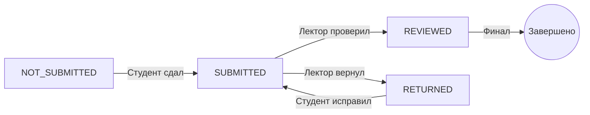

# HomeworkSubmission (Модель данных)

> Сдача домашнего задания студентом

## Описание

Модель `HomeworkSubmission` представляет сдачу домашнего задания ([[Homework]]) конкретным студентом ([[User]]). Хранит содержание работы, статус проверки, оценку и feedback от преподавателя.

**Функция**: [[Система домашних заданий]]  
**ADR**: [[ADR-005 MDX для домашних заданий]]

## Prisma Schema

```prisma
model HomeworkSubmission {
  id           String   @id @default(cuid())
  homeworkId   String
  userId       String
  content      String   @db.Text
  status       String   @default("NOT_SUBMITTED")
  grade        Int?
  feedback     String?  @db.Text
  submittedAt  DateTime?
  reviewedAt   DateTime?
  createdAt    DateTime @default(now())
  updatedAt    DateTime @updatedAt
  
  homework     Homework @relation(fields: [homeworkId], references: [id], onDelete: Cascade)
  user         User     @relation(fields: [userId], references: [id], onDelete: Cascade)
  comments     HomeworkComment[]

  @@unique([homeworkId, userId])
  @@index([status])
  @@index([submittedAt])
  @@map("homework_submissions")
}
```

## Поля модели

### Связи
- `homeworkId` - ID домашнего задания ([[Homework]])
- `userId` - ID студента ([[User]])

### Содержание
- `content` - текст работы в формате MDX (markdown с компонентами)

### Статусы
- `status` - текущий статус:
  - `NOT_SUBMITTED` - не сдано (по умолчанию)
  - `SUBMITTED` - сдано, ожидает проверки
  - `REVIEWED` - проверено
  - `RETURNED` - возвращено на доработку

### Оценка и обратная связь
- `grade` - оценка (обычно от 1 до 10)
- `feedback` - текстовый комментарий от преподавателя (MDX)

### Timestamps
- `submittedAt` - дата и время сдачи
- `reviewedAt` - дата и время проверки
- `createdAt` - дата создания записи
- `updatedAt` - дата последнего обновления

### Уникальность
- `@@unique([homeworkId, userId])` - студент может сдать одно ДЗ только один раз

### Индексы
- `@@index([status])` - быстрый поиск по статусу
- `@@index([submittedAt])` - сортировка по дате сдачи

## Связи (Relations)

### Many-to-One
- [[Homework]] - задание, которое сдается
- [[User]] - студент, который сдает

### One-to-Many
- [[HomeworkComment]] - инлайн-комментарии к работе

## Жизненный цикл



### 1. Создание записи (NOT_SUBMITTED)

При создании домашнего задания автоматически создаются записи HomeworkSubmission для всех студентов группы:

```typescript
// При создании Homework
const homework = await prisma.homework.create({
  data: {
    // ... поля homework
  }
})

// Создать submissions для всех студентов
const students = await prisma.user.findMany({
  where: {
    groupId: homework.groupId,
    role: 'student'
  }
})

await prisma.homeworkSubmission.createMany({
  data: students.map(student => ({
    homeworkId: homework.id,
    userId: student.id,
    content: '',
    status: 'NOT_SUBMITTED'
  }))
})
```

### 2. Сдача работы (SUBMITTED)

Студент пишет и сдает работу:

```typescript
await prisma.homeworkSubmission.update({
  where: {
    homeworkId_userId: {
      homeworkId,
      userId: session.user.id
    }
  },
  data: {
    content: mdxContent,
    status: 'SUBMITTED',
    submittedAt: new Date()
  }
})
```

### 3. Проверка (REVIEWED)

Преподаватель проверяет и выставляет оценку:

```typescript
await prisma.homeworkSubmission.update({
  where: { id: submissionId },
  data: {
    status: 'REVIEWED',
    grade: 8,
    feedback: 'Хорошая работа! ...',
    reviewedAt: new Date()
  }
})
```

### 4. Возврат на доработку (RETURNED)

Преподаватель возвращает работу:

```typescript
await prisma.homeworkSubmission.update({
  where: { id: submissionId },
  data: {
    status: 'RETURNED',
    feedback: 'Нужно доработать следующие моменты: ...',
    reviewedAt: new Date()
  }
})
```

## Примеры использования

### Получение всех работ по заданию

```typescript
const submissions = await prisma.homeworkSubmission.findMany({
  where: {
    homeworkId
  },
  include: {
    user: {
      select: {
        id: true,
        name: true,
        email: true
      }
    }
  },
  orderBy: {
    submittedAt: 'desc'
  }
})
```

### Получение работ на проверку

```typescript
const pendingReview = await prisma.homeworkSubmission.findMany({
  where: {
    status: 'SUBMITTED',
    homework: {
      subject: {
        lectorId: session.user.id  // Только мои предметы
      }
    }
  },
  include: {
    homework: {
      include: {
        subject: true,
        group: true
      }
    },
    user: true
  },
  orderBy: {
    submittedAt: 'asc'  // Сначала старые
  }
})
```

### Получение работы студента

```typescript
const submission = await prisma.homeworkSubmission.findUnique({
  where: {
    homeworkId_userId: {
      homeworkId,
      userId: session.user.id
    }
  },
  include: {
    homework: {
      include: {
        subject: {
          include: {
            lector: true
          }
        }
      }
    },
    comments: {
      include: {
        author: {
          select: {
            name: true,
            role: true
          }
        }
      },
      orderBy: {
        createdAt: 'asc'
      }
    }
  }
})
```

### Статистика по заданию

```typescript
const stats = await prisma.homeworkSubmission.groupBy({
  by: ['status'],
  where: {
    homeworkId
  },
  _count: {
    id: true
  }
})

// Результат: [
//   { status: 'NOT_SUBMITTED', _count: { id: 5 } },
//   { status: 'SUBMITTED', _count: { id: 10 } },
//   { status: 'REVIEWED', _count: { id: 15 } }
// ]
```

### Средняя оценка по заданию

```typescript
const avgGrade = await prisma.homeworkSubmission.aggregate({
  where: {
    homeworkId,
    grade: { not: null }
  },
  _avg: {
    grade: true
  },
  _count: {
    id: true
  }
})

console.log(`Средняя оценка: ${avgGrade._avg.grade?.toFixed(1)} (${avgGrade._count.id} работ)`)
```

### Просроченные работы

```typescript
const now = new Date()

const overdue = await prisma.homeworkSubmission.findMany({
  where: {
    status: 'NOT_SUBMITTED',
    homework: {
      deadline: {
        lt: now  // Дедлайн уже прошел
      },
      isActive: true
    }
  },
  include: {
    homework: {
      select: {
        title: true,
        deadline: true
      }
    },
    user: {
      select: {
        name: true,
        email: true
      }
    }
  }
})
```

### Лучшие работы

```typescript
const topSubmissions = await prisma.homeworkSubmission.findMany({
  where: {
    status: 'REVIEWED',
    grade: {
      gte: 9  // Оценка >= 9
    }
  },
  include: {
    user: {
      select: {
        name: true
      }
    },
    homework: {
      select: {
        title: true
      }
    }
  },
  orderBy: {
    grade: 'desc'
  },
  take: 10
})
```

## TypeScript типы

```typescript
// lib/types.ts
export type HomeworkSubmissionStatus = 
  | 'NOT_SUBMITTED'
  | 'SUBMITTED'
  | 'REVIEWED'
  | 'RETURNED'

export interface HomeworkSubmission {
  id: string
  homeworkId: string
  userId: string
  content: string
  status: HomeworkSubmissionStatus
  grade?: number
  feedback?: string
  submittedAt?: Date
  reviewedAt?: Date
  createdAt: Date
  updatedAt: Date
}

export interface HomeworkSubmissionWithRelations extends HomeworkSubmission {
  homework: Homework
  user: User
  comments: HomeworkComment[]
}
```

## Валидация

### Zod схема

```typescript
import { z } from 'zod'

export const submissionSchema = z.object({
  content: z.string().min(10, 'Слишком короткая работа'),
  status: z.enum(['NOT_SUBMITTED', 'SUBMITTED', 'REVIEWED', 'RETURNED'])
})

export const reviewSchema = z.object({
  grade: z.number().int().min(1).max(10),
  feedback: z.string().optional(),
  status: z.enum(['REVIEWED', 'RETURNED'])
})
```

## API Endpoints

**Документация**: [[Homework API]]

```typescript
// Получить работу студента
GET /api/homework/[id]/submission
Response: HomeworkSubmissionWithRelations

// Сдать/обновить работу
POST /api/homework/[id]/submission
Body: { content: string }

// Получить все работы по заданию (lector only)
GET /api/homework/[id]/submissions
Response: HomeworkSubmissionWithRelations[]

// Проверить работу (lector only)
PATCH /api/homework/submissions/[id]/review
Body: { grade: number, feedback?: string, status: 'REVIEWED' | 'RETURNED' }
```

## MDX редактор

**Компонент**: [[markdown-editor.tsx]]

```tsx
<MarkdownEditor
  value={submission.content}
  onChange={(value) => setContent(value)}
  placeholder="Напишите свое решение..."
/>
```

## Уведомления

### При сдаче работы

```typescript
// Уведомить лектора о новой работе
await sendNotification(homework.subject.lectorId, {
  title: 'Новая работа на проверку',
  message: `${student.name} сдал работу по "${homework.title}"`
})
```

### При проверке работы

```typescript
// Уведомить студента о проверке
await sendNotification(submission.userId, {
  title: 'Работа проверена',
  message: `Работа по "${homework.title}" проверена. Оценка: ${grade}`
})

// Telegram уведомление
if (student.telegramUser?.notifications) {
  await bot.sendMessage(student.telegramUser.chatId, {
    text: `✅ Работа проверена!\n\n📝 ${homework.title}\n⭐ Оценка: ${grade}/10`
  })
}
```

## Связанные заметки

### Модели
- [[Homework]] - домашнее задание
- [[HomeworkComment]] - комментарии к работе
- [[User]] - студент и преподаватель
- [[Subject]] - предмет

### Функции
- [[Система домашних заданий]] - детальное описание
- [[Telegram интеграция]] - уведомления

### Компоненты
- [[markdown-editor.tsx]] - редактор MDX
- [[markdown-viewer.tsx]] - просмотр MDX
- [[inline-comment-viewer.tsx]] - комментарии

### API
- [[Homework API]] - endpoints для работы

### ADR
- [[ADR-005 MDX для домашних заданий]] - архитектурное решение

### Роли
- [[Student]] - сдает работы
- [[Lector]] - проверяет работы
- [[Mentor]] - помогает студентам

## Файлы

- **Схема**: `prisma/schema.prisma`
- **Типы**: `lib/types.ts`
- **API**: `app/api/homework/**/*.ts`
- **Страницы**: `app/student/homework/**/*.tsx`, `app/lector/homework/**/*.tsx`
- **Компоненты**: `components/student/homework-submission-form.tsx`

## Официальная документация

- [docs/features/MDX_EDITOR_INTEGRATION.md](../../docs/features/MDX_EDITOR_INTEGRATION.md)

---

#model #prisma #homework #submissions #mdx

