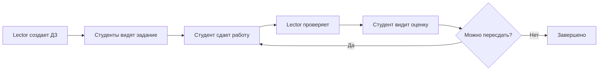

# Система домашних заданий

> Полный цикл работы с домашними заданиями: создание, сдача, проверка

## Обзор

Система домашних заданий - ключевая функция Шкед для организации учебного процесса. Поддерживает полный цикл от создания задания преподавателем до проверки с развернутым feedback.

## Workflow



## Участники

### Lector (Преподаватель) [[Lector]]
**Права**:
- ✅ Создание ДЗ для своих предметов
- ✅ Редактирование своих ДЗ
- ✅ Удаление своих ДЗ
- ✅ Просмотр всех работ студентов
- ✅ Проверка работ с оценкой и feedback
- ✅ Добавление inline комментариев

### Student (Студент) [[Student]]
**Права**:
- ✅ Просмотр ДЗ своей группы
- ✅ Сдача работ (MDX редактор)
- ✅ Просмотр своих оценок и feedback
- ✅ Просмотр inline комментариев
- ❌ Создание/редактирование ДЗ

### Admin (Администратор) [[Admin]]
**Права**:
- ✅ Полный доступ ко всем ДЗ
- ✅ Создание ДЗ для любых предметов
- ✅ Проверка любых работ

### Mentor (Ментор) [[Mentor]]
**Права**:
- ✅ Просмотр ДЗ своих групп
- ✅ Просмотр работ студентов
- ✅ Просмотр оценок и feedback
- ❌ Проверка работ

## Модели данных

### Homework [[Homework]]
Домашнее задание от преподавателя

```prisma
model Homework {
  id          String   @id
  title       String
  content     String?  // MDX контент задания
  deadline    DateTime
  subjectId   String
  groupId     String?
  materials   Json?    // Доп. материалы
  submissions HomeworkSubmission[]
}
```

### HomeworkSubmission [[HomeworkSubmission]]
Работа студента

```prisma
model HomeworkSubmission {
  id          String   @id
  homeworkId  String
  userId      String
  content     String?  // MDX работа студента
  status      String   // NOT_SUBMITTED, SUBMITTED, REVIEWED
  grade       Int?     // Оценка
  feedback    String?  // MDX feedback от лектора
  comments    HomeworkComment[]
}
```

### HomeworkComment [[HomeworkComment]]
Inline комментарии к работе

```prisma
model HomeworkComment {
  id           String @id
  submissionId String
  authorId     String
  content      String
  startOffset  Int
  endOffset    Int
  selectedText String
  resolved     Boolean
}
```

## Этапы работы

### 1. Создание задания (Lector)

**Страница**: `/lector/homework/create`  
**API**: `POST /api/homework`

**Форма создания**:
```typescript
{
  title: "Лабораторная работа №1",
  content: "# Задание\n\nРеализуйте...",  // MDX
  subjectId: "subject-id",
  groupId: "group-id",
  deadline: "2024-11-15T23:59:00",
  materials: [
    { name: "Лекция", url: "...", type: "pdf" }
  ]
}
```

**Компонент**: [[homework-form.tsx]]  
**Редактор**: [[markdown-editor.tsx]]

После создания:
- Задание появляется у студентов группы
- Отправляются Telegram уведомления
- Создаются пустые submissions для каждого студента

### 2. Просмотр заданий (Student)

**Страница**: `/student/homework`

**Списки**:
- **Активные** - deadline не прошел, не сдано
- **Сданные** - status = SUBMITTED
- **Проверенные** - status = REVIEWED

**Фильтры**:
- По предмету
- По статусу  
- По дедлайну

**Для каждого задания показывается**:
- Название и предмет
- Дедлайн (с таймером если скоро)
- Статус (не сдано / сдано / проверено)
- Оценка (если проверено)

### 3. Сдача работы (Student)

**Страница**: `/student/homework/[id]`  
**API**: `POST /api/homework/[id]/submit`

**Интерфейс**:
1. Просмотр задания (MDX viewer)
2. MDX редактор для работы
3. Опционально: ссылка на внешнее решение
4. Кнопка "Сдать работу"

**Автосохранение**:
```typescript
// Каждые 30 секунд
useEffect(() => {
  const interval = setInterval(() => {
    saveDraft(content)
  }, 30000)
  return () => clearInterval(interval)
}, [content])
```

**Отправка**:
```typescript
await fetch(`/api/homework/${homeworkId}/submit`, {
  method: 'POST',
  body: JSON.stringify({
    content: mdxContent,
    submissionUrl: externalUrl
  })
})

// Меняет status: NOT_SUBMITTED → SUBMITTED
// Отправляет уведомление лектору
```

### 4. Проверка работы (Lector)

**Страница**: `/lector/homework/[id]/submissions/[submissionId]`  
**API**: `POST /api/homework/[id]/submissions/[submissionId]/review`

**Интерфейс**:
1. Информация о студенте
2. Задание (MDX)
3. Работа студента (MDX viewer)
4. Форма оценивания:
   - Поле оценки (1-10 или 1-100)
   - MDX редактор для feedback
   - Возможность добавлять inline комментарии
5. Кнопка "Сохранить проверку"

**Inline комментарии**:
```typescript
// При выделении текста в работе студента
function addInlineComment(
  selectedText: string,
  startOffset: number,
  endOffset: number
) {
  const comment = prompt("Ваш комментарий:")
  
  await fetch(`/api/homework/${hwId}/submissions/${subId}/comments`, {
    method: 'POST',
    body: JSON.stringify({
      content: comment,
      selectedText,
      startOffset,
      endOffset
    })
  })
}
```

**Отправка проверки**:
```typescript
await fetch(`/api/homework/${hwId}/submissions/${subId}/review`, {
  method: 'POST',
  body: JSON.stringify({
    grade: 8,
    feedback: "# Отличная работа!\n\n...",  // MDX
    status: 'REVIEWED'
  })
})

// Меняет status: SUBMITTED → REVIEWED
// Отправляет уведомление студенту
```

### 5. Просмотр результата (Student)

**Страница**: `/student/homework/[id]`

**После проверки студент видит**:
- ✅ Оценка
- ✅ Развернутый feedback (MDX)
- ✅ Inline комментарии в своей работе
- ✅ Дата проверки
- ⚠️ Возможность пересдачи (если разрешено)

## MDX редактор

**ADR**: [[ADR-005 MDX для домашних заданий]]

### Возможности

**Форматирование**:
- Заголовки (H1-H6)
- Жирный, курсив, зачеркнутый
- Списки (маркированные, нумерованные, задачи)
- Цитаты

**Код**:
```python
def hello():
    print("Hello, World!")
```

**Таблицы**:
| Заголовок 1 | Заголовок 2 |
|-------------|-------------|
| Ячейка 1    | Ячейка 2    |

**Ссылки и изображения**:
- [Ссылка](https://example.com)
- 

### Компоненты

- [[markdown-editor.tsx]] - для создания/редактирования
- [[markdown-viewer.tsx]] - для просмотра
- [[inline-comment-viewer.tsx]] - для inline комментариев

## API Endpoints

**Документация**: [[Homework API]]

### Основные операции

```typescript
// Список заданий
GET /api/homework?groupId={id}&subjectId={id}

// Создать задание (lector, admin)
POST /api/homework
{
  title, content, subjectId, groupId, deadline, materials
}

// Обновить задание (lector своих, admin всех)
PUT /api/homework/[id]

// Удалить задание (lector своих, admin всех)
DELETE /api/homework/[id]

// Сдать работу (student)
POST /api/homework/[id]/submit
{
  content, submissionUrl
}

// Список работ по заданию (lector, admin)
GET /api/homework/[id]/submissions

// Проверить работу (lector, admin)
POST /api/homework/[id]/submissions/[submissionId]/review
{
  grade, feedback, status
}

// Inline комментарии
POST /api/homework/[id]/submissions/[submissionId]/comments
{
  content, selectedText, startOffset, endOffset
}
```

## Статусы работы

### NOT_SUBMITTED
- Работа не сдана
- Видна только студенту
- Можно редактировать и сдать

### SUBMITTED
- Работа сдана, ожидает проверки
- Студент не может редактировать
- Лектор может проверить
- В списке "На проверке"

### REVIEWED
- Работа проверена
- Есть оценка и feedback
- Студент видит результат
- Можно разрешить пересдачу

## Уведомления

**Система**: [[Telegram интеграция]]

### Для студентов
- 📝 Новое домашнее задание
- ⏰ Напоминание за 24 часа до дедлайна
- ⏰ Напоминание за 2 часа до дедлайна
- ✅ Работа проверена (с оценкой)
- 📊 Еженедельная сводка по ДЗ

### Для лекторов
- 📬 Новая сданная работа
- 📊 Еженедельная сводка по проверкам

## Статистика

### Для студента
```typescript
const stats = {
  totalHomework: 15,
  submitted: 12,
  reviewed: 10,
  avgGrade: 8.5,
  pendingDeadlines: 3
}
```

### Для лектора
```typescript
const stats = {
  totalHomework: 8,        // Создано заданий
  totalSubmissions: 120,   // Всего работ
  pendingReviews: 25,      // Ожидают проверки
  reviewedToday: 5,        // Проверено сегодня
  avgGradeGiven: 8.2       // Средняя оценка
}
```

### Для группы
```typescript
const groupStats = {
  homework: {
    title: "Лабораторная №1",
    totalStudents: 20,
    submitted: 15,           // 75%
    reviewed: 12,            // 80% от сданных
    avgGrade: 8.3,
    deadline: "2024-11-15"
  }
}
```

## Best Practices

### Для лекторов

1. **Четкие задания**: Используйте MDX для структурирования
2. **Примеры**: Добавляйте примеры кода и решений
3. **Критерии**: Указывайте критерии оценивания
4. **Материалы**: Прикладывайте дополнительные материалы
5. **Своевременная проверка**: Проверяйте в течение 3-5 дней

### Для студентов

1. **Не откладывайте**: Сдавайте заранее, не в последний момент
2. **Форматирование**: Используйте MDX для читаемости
3. **Комментарии**: Комментируйте код
4. **Тесты**: Добавляйте результаты тестирования
5. **Вопросы**: Задавайте вопросы лектору заранее

## Связанные заметки

### Модели
- [[Homework]] - модель задания
- [[HomeworkSubmission]] - модель работы
- [[HomeworkComment]] - inline комментарии
- [[User]] - студенты и лекторы
- [[Subject]] - предмет задания
- [[Group]] - группа студентов

### Роли
- [[Lector]] - создает и проверяет ДЗ
- [[Student]] - сдает ДЗ
- [[Admin]] - полный доступ
- [[Mentor]] - мониторинг (без проверки)

### Функции
- [[Telegram интеграция]] - уведомления о ДЗ

### API
- [[Homework API]] - детальная документация endpoints

### ADR
- [[ADR-005 MDX для домашних заданий]] - выбор формата

### Компоненты
- [[homework-form.tsx]] - форма создания ДЗ
- [[homework-submission-form.tsx]] - форма сдачи
- [[markdown-editor.tsx]] - MDX редактор
- [[markdown-viewer.tsx]] - просмотр MDX
- [[inline-comment-viewer.tsx]] - inline комментарии

## Файлы

- **Модели**: `prisma/schema.prisma`
- **API**: `app/api/homework/**/*.ts`
- **Lector страницы**: `app/lector/homework/**/*.tsx`
- **Student страницы**: `app/student/homework/**/*.tsx`
- **Компоненты**: 
  - `components/lector/homework-form.tsx`
  - `components/student/homework-submission-form.tsx`
  - `components/ui/markdown-editor.tsx`
  - `components/ui/markdown-viewer.tsx`

## Официальная документация

- [docs/features/MDX_EDITOR_INTEGRATION.md](../../docs/features/MDX_EDITOR_INTEGRATION.md)

---

#function #homework #mdx #education #core

