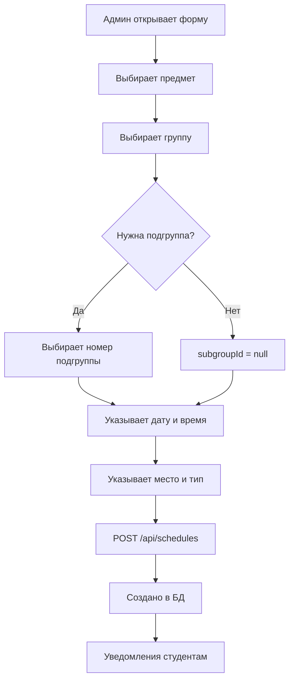
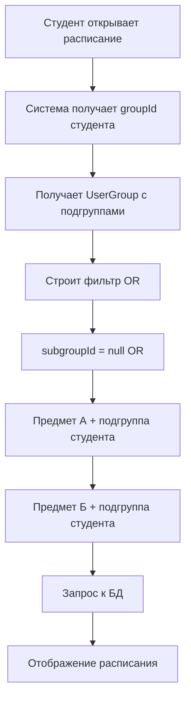

# Управление расписанием

> Система создания, просмотра и управления расписанием занятий

## Обзор

Управление расписанием - ключевая функция системы Шкед, позволяющая создавать расписание занятий для групп с учетом подгрупп и автоматически отображать персонализированное расписание для каждого студента.

## Основные возможности

### Для администраторов ([[Admin]])
- ✅ Создание занятий для любых групп
- ✅ Редактирование существующих занятий
- ✅ Удаление занятий
- ✅ Массовое создание расписания
- ✅ Назначение подгрупп для занятий
- ✅ Указание времени, места, типа занятия
- ✅ Просмотр расписания всех групп

### Для студентов ([[Student]])
- ✅ Просмотр персонального расписания
- ✅ Автоматическая фильтрация по подгруппам
- ✅ Календарный вид
- ✅ Расписание на день/неделю
- ✅ Информация о занятии (время, место, преподаватель)
- ✅ Telegram уведомления о занятиях

### Для лекторов ([[Teacher]])
- ✅ Просмотр расписания своих предметов
- ✅ Календарный вид
- ✅ Информация о группах
- ✅ Telegram уведомления о занятиях

### Для менторов ([[Mentor]])
- ✅ Просмотр расписания своих групп
- ✅ Мониторинг занятости студентов
- ✅ Календарный вид

## Модели данных

### Schedule
**Модель**: [[Schedule]]

```prisma
model Schedule {
  id          String   @id @default(cuid())
  subjectId   String
  groupId     String?
  subgroupId  String?  // null = вся группа, "1"/"2"/"3" = подгруппа
  date        DateTime
  dayOfWeek   Int      // 0-6
  startTime   String   // "HH:MM"
  endTime     String   // "HH:MM"
  location    String?
  eventType   String?  // Лекция, Семинар, Практика
  description String?
  isActive    Boolean
}
```

### Связанные модели
- [[Subject]] - предмет занятия
- [[Group]] - группа студентов
- [[UserGroup]] - подгруппы студентов
- [[User]] - студенты и лектор

## Архитектура

### Создание расписания (Admin)



### Просмотр расписания (Student)



## API Endpoints

**Документация**: [[Schedules API]]

### GET /api/schedules
Получить список расписания

**Query параметры**:
- `groupId` - фильтр по группе
- `subjectId` - фильтр по предмету
- `date` - конкретная дата
- `startDate` + `endDate` - диапазон дат

**Примеры**:
```typescript
// Расписание группы на неделю
GET /api/schedules?groupId=group123&startDate=2024-11-04&endDate=2024-11-10

// Расписание по предмету
GET /api/schedules?subjectId=subject456

// Расписание на конкретный день
GET /api/schedules?date=2024-11-05
```

### POST /api/schedules (Admin only)
Создать занятие

**Body**:
```json
{
  "subjectId": "cuid...",
  "groupId": "cuid...",
  "subgroupId": "1",
  "date": "2024-11-05T10:00:00.000Z",
  "dayOfWeek": 1,
  "startTime": "10:00",
  "endTime": "11:30",
  "location": "Ауд. 123",
  "eventType": "Лекция",
  "description": "Введение в алгоритмы"
}
```

### PUT /api/schedules/[id] (Admin only)
Обновить занятие

### DELETE /api/schedules/[id] (Admin only)
Удалить занятие

## Компоненты

### Admin компоненты
**Файл**: `components/admin/schedule-form.tsx`

```typescript
'use client'

export function ScheduleForm() {
  return (
    <form>
      <Select name="subjectId" label="Предмет" />
      <Select name="groupId" label="Группа" />
      <Select name="subgroupId" label="Подгруппа">
        <option value="">Вся группа</option>
        <option value="1">Подгруппа 1</option>
        <option value="2">Подгруппа 2</option>
        <option value="3">Подгруппа 3</option>
      </Select>
      <DatePicker name="date" label="Дата" />
      <Input name="startTime" type="time" label="Начало" />
      <Input name="endTime" type="time" label="Конец" />
      <Input name="location" label="Место" />
      <Select name="eventType" label="Тип занятия">
        <option value="Лекция">Лекция</option>
        <option value="Семинар">Семинар</option>
        <option value="Практика">Практика</option>
        <option value="Лабораторная">Лабораторная</option>
      </Select>
      <Button type="submit">Создать</Button>
    </form>
  )
}
```

### Student компоненты
**Страницы**:
- `app/student/page.tsx` - расписание на неделю
- `app/student/calendar/page.tsx` - календарный вид

## Подгруппы

**Документация**: [[Система подгрупп]]  
**ADR**: [[ADR-006 Система подгрупп]]

### Принцип работы

Студент может быть в разных подгруппах для разных предметов. Система автоматически фильтрует расписание:

```typescript
async function getStudentSchedule(studentId: string, groupId: string) {
  // 1. Получить подгруппы студента
  const userGroup = await prisma.userGroup.findUnique({
    where: {
      userId_groupId: { userId: studentId, groupId: groupId }
    }
  })
  
  // 2. Получить ID предметов
  const subjects = await prisma.subject.findMany()
  const commerceSubject = subjects.find(s => s.name === 'Коммерция')
  const tutorialSubject = subjects.find(s => s.name === 'Семинары')
  // ... и другие
  
  // 3. Построить фильтр
  const schedules = await prisma.schedule.findMany({
    where: {
      groupId: groupId,
      OR: [
        { subgroupId: null }, // Для всей группы
        {
          subjectId: commerceSubject?.id,
          subgroupId: userGroup?.subgroupCommerce?.toString()
        },
        {
          subjectId: tutorialSubject?.id,
          subgroupId: userGroup?.subgroupTutorial?.toString()
        }
        // ... для других предметов с подгруппами
      ]
    },
    include: {
      subject: {
        include: {
          Teacher: true
        }
      }
    },
    orderBy: [
      { date: 'asc' },
      { startTime: 'asc' }
    ]
  })
  
  return schedules
}
```

### Пример

**Студент Иван**:
- Коммерция - подгруппа 1
- Семинары - подгруппа 2

**Расписание группы**:
1. Математика (вся группа) - Иван **видит** ✅
2. Коммерция подгруппа 1 - Иван **видит** ✅
3. Коммерция подгруппа 2 - Иван **не видит** ❌
4. Семинары подгруппа 1 - Иван **не видит** ❌
5. Семинары подгруппа 2 - Иван **видит** ✅

## Типы занятий

### Стандартные типы
- **Лекция** - основное занятие для всей группы
- **Семинар** - практические занятия (часто по подгруппам)
- **Практика** - практические работы
- **Лабораторная** - лабораторные работы
- **Консультация** - консультации перед экзаменом
- **Экзамен** - экзамен по предмету

### Цветовое кодирование (UI)

```typescript
const eventTypeColors = {
  'Лекция': 'bg-blue-500',
  'Семинар': 'bg-green-500',
  'Практика': 'bg-yellow-500',
  'Лабораторная': 'bg-purple-500',
  'Консультация': 'bg-orange-500',
  'Экзамен': 'bg-red-500'
}
```

## Уведомления

**Система**: [[Telegram интеграция]]

### Автоматические уведомления

#### Напоминание о занятии (за 30 минут)
```typescript
// Cron задача каждые 5 минут
async function sendScheduleReminders() {
  const now = new Date()
  const in30Minutes = new Date(now.getTime() + 30 * 60000)
  
  const upcomingSchedules = await prisma.schedule.findMany({
    where: {
      date: {
        gte: now,
        lte: in30Minutes
      },
      isActive: true
    },
    include: {
      subject: {
        include: {
          Teacher: {
            include: { telegramUser: true }
          }
        }
      },
      group: {
        include: {
          users: {
            where: { role: 'student' },
            include: { telegramUser: true }
          }
        }
      }
    }
  })
  
  for (const schedule of upcomingSchedules) {
    // Уведомить студентов
    for (const student of schedule.group.users) {
      if (student.telegramUser?.notifications) {
        await sendTelegramMessage(student.telegramUser.chatId, {
          text: `📚 Через 30 минут: ${schedule.subject.name}
📍 ${schedule.location}
🕐 ${schedule.startTime}-${schedule.endTime}`
        })
      }
    }
    
    // Уведомить лектора
    if (schedule.subject.Teacher?.telegramUser?.notifications) {
      await sendTelegramMessage(
        schedule.subject.Teacher.telegramUser.chatId,
        {
          text: `📚 Через 30 минут: ${schedule.subject.name}
👥 Группа: ${schedule.group.name}
📍 ${schedule.location}`
        }
      )
    }
  }
}
```

#### Дневная сводка (ежедневно в 7:00)
```typescript
async function sendDailySummary() {
  const today = new Date()
  today.setHours(0, 0, 0, 0)
  const tomorrow = new Date(today)
  tomorrow.setDate(tomorrow.getDate() + 1)
  
  const users = await prisma.user.findMany({
    where: {
      telegramUser: {
        notifications: true
      }
    },
    include: {
      telegramUser: true,
      group: true
    }
  })
  
  for (const user of users) {
    const todaySchedule = await getStudentSchedule(
      user.id,
      user.groupId,
      today,
      tomorrow
    )
    
    if (todaySchedule.length > 0) {
      const message = `🌅 Доброе утро! Расписание на сегодня:\n\n` +
        todaySchedule.map(s => 
          `${s.startTime} - ${s.subject.name} (${s.location})`
        ).join('\n')
      
      await sendTelegramMessage(user.telegramUser.chatId, { text: message })
    }
  }
}
```

## Массовое создание расписания

### Создание на весь семестр
```typescript
async function createSemesterSchedule({
  subjectId,
  groupId,
  dayOfWeek,
  startTime,
  endTime,
  location,
  eventType,
  startDate,
  endDate
}: CreateSemesterScheduleParams) {
  const schedules = []
  
  // Найти все даты с нужным днем недели
  for (
    let date = new Date(startDate);
    date <= endDate;
    date.setDate(date.getDate() + 7)  // +1 неделя
  ) {
    if (date.getDay() === dayOfWeek) {
      schedules.push({
        subjectId,
        groupId,
        date: new Date(date),
        dayOfWeek,
        startTime,
        endTime,
        location,
        eventType
      })
    }
  }
  
  await prisma.schedule.createMany({
    data: schedules
  })
  
  return schedules.length
}

// Использование
await createSemesterSchedule({
  subjectId: 'math-id',
  groupId: 'group-id',
  dayOfWeek: 1,  // Понедельник
  startTime: '10:00',
  endTime: '11:30',
  location: 'Ауд. 123',
  eventType: 'Лекция',
  startDate: new Date('2024-09-01'),
  endDate: new Date('2024-12-31')
})
```

## Экспорт расписания

### В iCal формат
```typescript
function exportToiCal(schedules: Schedule[]): string {
  let ical = 'BEGIN:VCALENDAR\nVERSION:2.0\nPRODID:-//Shked//RU\n'
  
  for (const schedule of schedules) {
    const startDateTime = new Date(schedule.date)
    const [startHour, startMin] = schedule.startTime.split(':')
    startDateTime.setHours(parseInt(startHour), parseInt(startMin))
    
    const endDateTime = new Date(schedule.date)
    const [endHour, endMin] = schedule.endTime.split(':')
    endDateTime.setHours(parseInt(endHour), parseInt(endMin))
    
    ical += `BEGIN:VEVENT\n`
    ical += `DTSTART:${formatICalDate(startDateTime)}\n`
    ical += `DTEND:${formatICalDate(endDateTime)}\n`
    ical += `SUMMARY:${schedule.subject.name}\n`
    ical += `LOCATION:${schedule.location}\n`
    ical += `DESCRIPTION:${schedule.eventType}\n`
    ical += `END:VEVENT\n`
  }
  
  ical += 'END:VCALENDAR'
  return ical
}
```

## Связанные заметки

### Модели
- [[Schedule]] - модель расписания
- [[Subject]] - предмет
- [[Group]] - группа
- [[UserGroup]] - подгруппы
- [[User]] - студенты и лектор

### Функции
- [[Система подгрупп]] - фильтрация расписания
- [[Telegram интеграция]] - уведомления

### API
- [[Schedules API]] - endpoints

### Роли
- [[Admin]] - создание расписания
- [[Student]] - просмотр расписания
- [[Teacher]] - просмотр своего расписания
- [[Mentor]] - просмотр расписания групп

### ADR
- [[ADR-006 Система подгрупп]]

## Файлы

- **Модель**: `prisma/schema.prisma`
- **API**: `app/api/schedules/route.ts`
- **Admin страницы**: `app/admin/schedule/page.tsx`
- **Student страницы**: 
  - `app/student/page.tsx`
  - `app/student/calendar/page.tsx`
- **Компоненты**: `components/admin/schedule-form.tsx`
- **Уведомления**: `lib/telegram/notifications.ts`
- **Cron**: `lib/cron/init.ts`

## Официальная документация

- [docs/README.md](../../docs/README.md)

---

#function #schedule #timetable #core

