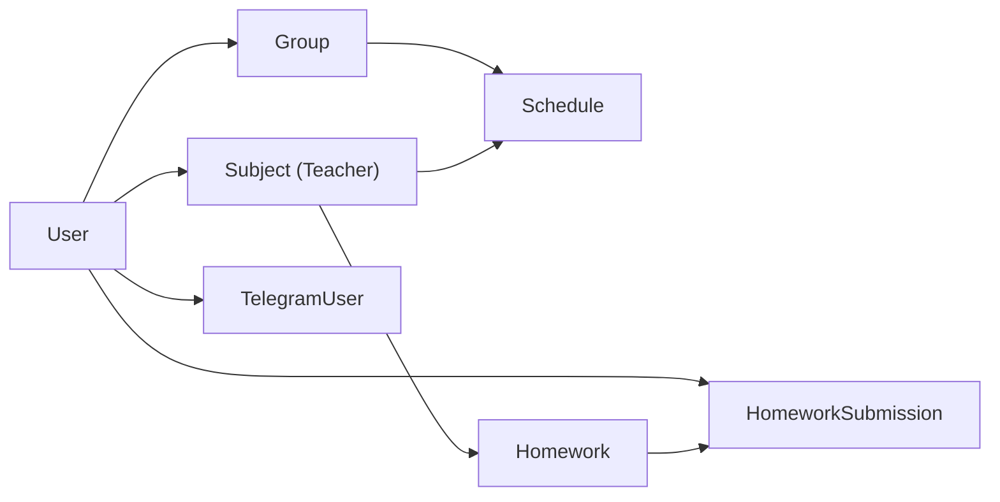

# ADR-002: Использование Prisma ORM

**Статус**: ✅ Принято  
**Дата**: Январь 2024  
**Авторы**: Павел Шершнёв  
**Связи**: [[База данных]], [[PostgreSQL]], [[TypeScript типы]]

## Контекст и проблема

Для работы с базой данных PostgreSQL необходимо выбрать ORM/Query Builder, который обеспечит:
- Type-safety для TypeScript
- Удобную работу с миграциями
- Поддержку сложных запросов и связей
- Хорошую производительность
- Современный DX

## Рассмотренные варианты

### 1. Prisma ✅
**Описание**: Современный TypeScript-first ORM

**Плюсы**:
- ✅ Автогенерация TypeScript типов из схемы
- ✅ Удобный Prisma Studio для просмотра БД
- ✅ Декларативные миграции
- ✅ Introspection существующих БД
- ✅ Отличная документация
- ✅ Первоклассная поддержка PostgreSQL
- ✅ Интеграция с Next.js из коробки
- ✅ Поддержка transactions, relations, aggregations

**Минусы**:
- ⚠️ Дополнительный слой абстракции
- ⚠️ Binary dependency (prisma engine)
- ⚠️ Сложные запросы иногда требуют raw SQL

### 2. TypeORM
**Описание**: Популярный ORM для TypeScript

**Плюсы**:
- ✅ Много функций
- ✅ Декораторы для моделей
- ✅ ActiveRecord и DataMapper

**Минусы**:
- ❌ Меньше type-safety
- ❌ Сложнее настройка миграций
- ❌ Менее современный API

### 3. Drizzle ORM
**Описание**: Новый легковесный ORM

**Плюсы**:
- ✅ Минимальный overhead
- ✅ SQL-like синтаксис
- ✅ Type-safety

**Минусы**:
- ❌ Молодой проект (меньше примеров)
- ❌ Меньше функций из коробки
- ❌ Меньше инструментов (нет Studio)

### 4. Knex.js + ручные типы
**Описание**: Query builder без ORM

**Плюсы**:
- ✅ Полный контроль над SQL
- ✅ Легковесный

**Минусы**:
- ❌ Нет автогенерации типов
- ❌ Больше boilerplate кода
- ❌ Ручная поддержка типов

## Решение

**Выбран Prisma ORM**

### Обоснование

1. **Type-safety**: Критично для TypeScript проекта. Prisma генерирует типы автоматически при каждом изменении схемы.

2. **Developer Experience**: 
   - Prisma Studio для визуализации данных
   - Autocomplete в IDE для всех запросов
   - Понятные error messages

3. **Миграции**: Простой workflow:
   ```bash
   npx prisma migrate dev --name add_feature
   ```

4. **Интеграция с Next.js**: Официальные примеры и best practices

5. **Схема как source of truth**:
   ```prisma
   model User {
     id    String @id @default(cuid())
     email String @unique
     role  String @default("student")
   }
   ```

## Структура схемы

**Файл**: `prisma/schema.prisma`

### Основные модели
- [[User]] - пользователи системы
- [[Group]] - учебные группы  
- [[Subject]] - предметы
- [[Schedule]] - расписание
- [[Homework]] - домашние задания
- [[HomeworkSubmission]] - работы студентов
- [[TelegramUser]] - Telegram интеграция
- [[BotSettings]] - настройки бота

### Связи между моделями



## Последствия

### Положительные

- ✅ **Zero-cost type-safety**: Все запросы типизированы
- ✅ **Меньше ошибок**: Ловятся на этапе компиляции
- ✅ **Быстрая разработка**: Autocomplete + Studio
- ✅ **Удобные миграции**: Автоматическое отслеживание изменений
- ✅ **Документация через код**: Schema читается как документация

### Негативные

- ⚠️ **Binary dependency**: Нужен prisma engine (учтено в Docker)
- ⚠️ **Генерация типов**: Нужно запускать `prisma generate` после изменений
- ⚠️ **Размер bundle**: Prisma client добавляет ~500KB

### Смягчения

1. **Docker multi-stage build**: Уменьшает итоговый размер образа
2. **CI/CD автоматизация**: `prisma generate` в GitHub Actions
3. **Кеширование**: Prisma cache для ускорения запросов

## Примеры использования

### Создание записи
```typescript
const user = await prisma.user.create({
  data: {
    email: 'student@mipt.ru',
    password: hashedPassword,
    role: 'student',
    groupId: 'group123'
  }
})
```

### Запрос с relations
```typescript
const homework = await prisma.homework.findUnique({
  where: { id: homeworkId },
  include: {
    subject: true,
    group: true,
    submissions: {
      include: {
        user: {
          select: { name: true, email: true }
        }
      }
    }
  }
})
```

### Transactions
```typescript
await prisma.$transaction(async (tx) => {
  await tx.homework.create({ data: hwData })
  await tx.notification.create({ data: notifData })
})
```

### Raw SQL (когда нужно)
```typescript
const result = await prisma.$queryRaw`
  SELECT * FROM users WHERE created_at > ${date}
`
```

## Влияние на другие компоненты

### Затронутые области
- [[TypeScript типы]] - автогенерируются из схемы
- [[API Routes]] - используют prisma client
- [[Seed скрипты]] - заполнение БД тестовыми данными
- [[Testing]] - моки prisma для тестов
- [[Deployment]] - миграции в CI/CD

### Связанные решения
- [[ADR-001 Next.js 14 App Router]] - легкая интеграция
- [[ADR-003 NextAuth.js аутентификация]] - Prisma Adapter
- [[PostgreSQL]] - целевая БД

## Конфигурация

### prisma/schema.prisma
```prisma
generator client {
  provider      = "prisma-client-js"
  binaryTargets = ["native", "linux-musl-openssl-3.0.x"]
}

datasource db {
  provider = "postgresql"
  url      = env("DATABASE_URL")
}
```

### lib/db.ts
```typescript
import { PrismaClient } from '@prisma/client'

const globalForPrisma = global as unknown as { prisma: PrismaClient }

export const prisma = globalForPrisma.prisma || new PrismaClient()

if (process.env.NODE_ENV !== 'production') {
  globalForPrisma.prisma = prisma
}
```

## Миграции

### Workflow
1. Изменить `schema.prisma`
2. Запустить `npx prisma migrate dev --name migration_name`
3. Prisma создаст SQL миграцию в `prisma/migrations/`
4. Запустить `npx prisma generate` для обновления типов
5. Коммит изменений (schema + миграции)

### Production
```bash
npx prisma migrate deploy
```

### Rollback
Prisma не поддерживает автоматический rollback. Нужно:
1. Создать новую миграцию, отменяющую изменения
2. Или восстановить БД из backup

## Ссылки

### Документация
- [Prisma Documentation](https://www.prisma.io/docs)
- [Prisma Best Practices](https://www.prisma.io/docs/guides/performance-and-optimization/connection-management)
- [Next.js + Prisma](https://www.prisma.io/nextjs)

### Внутренние ресурсы
- [[База данных]]
- [[TypeScript типы]]
- [[Seed скрипты]]
- Официальная схема: `prisma/schema.prisma`

## История обновлений

- **2024-01**: Первоначальное решение
- **2024-03**: Добавлены модели HomeworkComment
- **2024-10**: Оптимизация индексов

---

#adr #architecture #prisma #database #orm #decision

